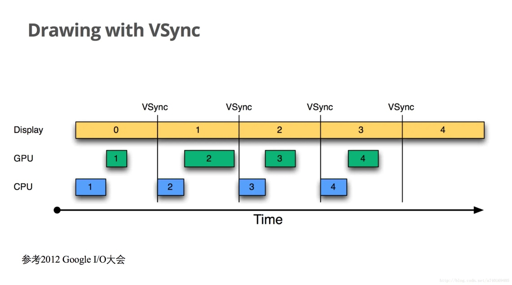
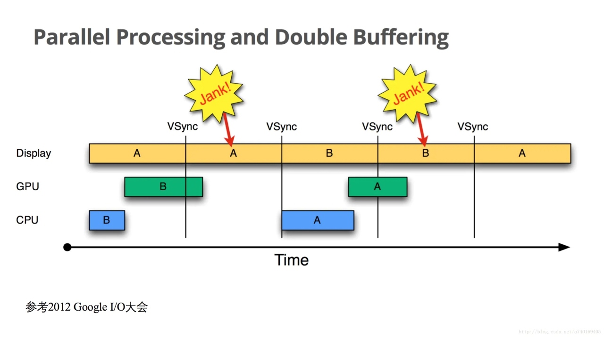
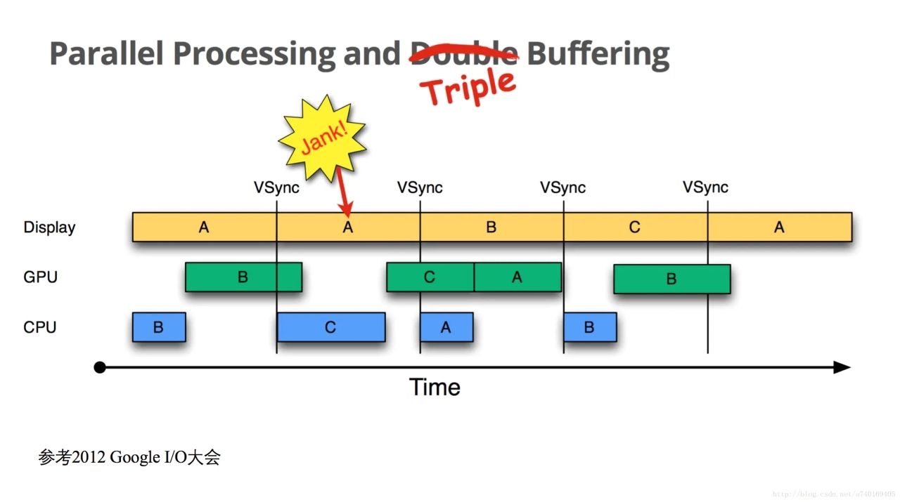

# Android屏幕刷新机制

### 1. 显示系统设计到三个部分

- CPU：中央处理器。用于计算屏幕需要的数据，交给GPU
- GPU：图形处理器（显卡）。对图形进行处理绘制，存到缓存区
- display：显示屏幕。从缓存区里读取数据，显示出来。

### 2. 屏幕显示会出现的问题
#### （1）掉帧

##### ① 掉帧什么意思

- 帧：一帧是一幅静止的画面，连续的帧形成动画
- 帧率：1秒内显示的帧数，用fps表示，单位Hz
- 视觉暂留现象：一般帧率达到10~12Hz，人眼会认为画面是连贯的。电影帧率一般是24Hz，手机帧率一般是60Hz（处理一帧数据需要1000/60≈16.6ms）
- 掉帧：原来60的帧率，突然降到了20，画面卡了

##### ② 为什么掉帧

- 硬件原因：硬件配置低，无法支持高帧率
- 软件原因：软件自身没做好优化，一帧的数据计算量太大
- 网络原因：网络影响画面传输

#### （2）画面撕裂

##### ① 画面撕裂是什么

显示器上半截显示了第一帧的画面，下半截显示了第二帧的画面

##### ② 为什么会出现画面撕裂

显示器从缓存区Buffer拿到数据之后，是“从左到右，从上到下”逐行扫描显示到屏幕上的。

如果逐行扫描的过程中，Buffer里的数据变了，就会导致画面撕裂。

#### （3）双缓存+垂直同步

为了解决画面撕裂问题，有了`双缓存+垂直同步`的概念。

##### ① 垂直同步 VSync信号

通过垂直同步信号，让显示器的帧率和GPU的帧率统一。

在显示器绘制完一帧之后，系统会发送一个VSync信号，告诉CPU和GPU可以准备下一帧了，等下一帧绘制完成，再发送一个VSync信号。

这样重复发送，限制了GPU的帧率，按照显示器的标准来绘制图像

##### ② 双缓存

- `backBuffer`：缓存CPU/GPU处理好的图像数据
- `frameBuffer`：缓存display要用的数据

CPU/GPU计算的一帧内容回放在`backBuffer`，而显示器只会读取`frameBuffer`的数据，是一帧完整的画面。

具体过程如下：

- 屏幕绘制完一帧内容，系统发送VSync信号
- 两个缓存区的内容交换
- 显示器开始显示交换后的frameBuffer的内容
- CPU/GPU处理下一帧数据，处理好之后将内容放进backBuffer里

#### （3）三缓存

上面的策略，还是会导致掉帧问题。

如上图所示，当同步信号到达时，GPU的当前帧数据还没有处理好，backBuffer里面没数据，交换到frameBuffer也就没有数据。

显示器拿不到数据，无法显示下一帧，而CPU也没法处理下一帧数据，第二个16.6ms就浪费了，在第二个同步信号到达时，CPU才开始处理数据，影响了后面所有帧的进度。

##### 三缓存

- `backBuffer`，`tripleBuffer`：缓存CPU/GPU处理好的图像数据
- `frameBuffer`：缓存display要用的数据

 
给CPU/GPU增加多一个缓存区。

因为上面掉帧的问题在于，同步信号到达时，`backBuffer`被GPU占用，CPU没法开始新一帧的计算。

增加新的缓存区，即使`backBuffer`被GPU占用了，CPU也可以使用`tripleBuffer`开始计算。

如此， CPU、GPU、Display都有了自己的缓存区，三个都可以做自己的事情不被干扰，减少了掉帧的概率。

