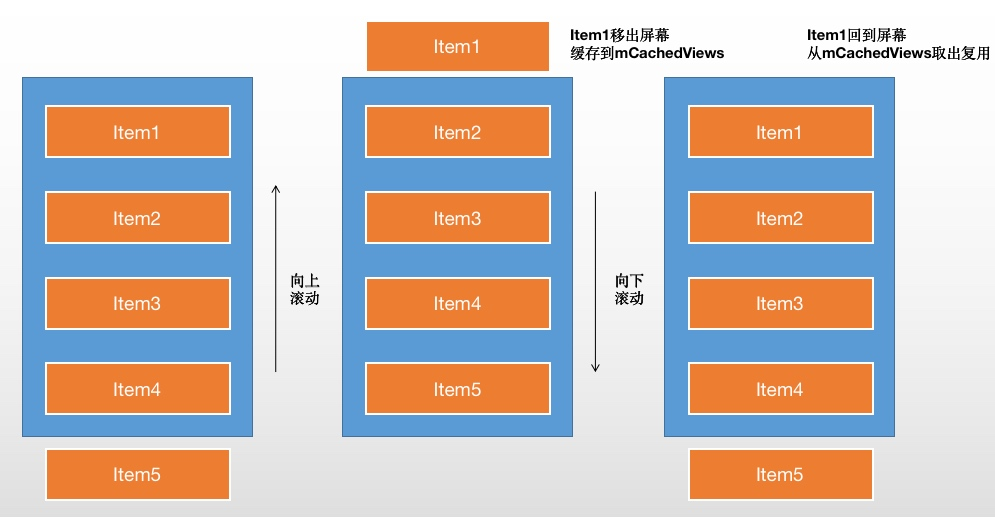

# RecyclerView缓存机制

一般认为RecyclerView有四级缓存。


| 层级 | 变量 | 名称 | 说明 |
| :-: | :-: | :-: | :-: |
| 1 | <div>mChangeScrap</div><div>mAttachScrap</div> | 可见缓存 | 用于屏幕可见区域的表项缓存复用 |
| 2 | mChachedViews | 缓存列表 | <div>用于移出屏幕的表项的缓存复用</div><div>（不会清空数据） </div>|
| 3 | mViewCacheExtension | 自定义缓存 | 开发者可以自定义的缓存 |
| 4 | RecycledViewPool | 缓存池 | <div>用于移出屏幕的表项的缓存复用<div></div>（会清掉数据，重新调用onBindViewHolder）</div> |


### 1. 一级缓存 —— Scrap

#### （1）原理

Scrap，用于缓存出现在屏幕中的item，包括两个变量 `mChangedScrap` `mAttachedScrap`。

当调用notifyItemRemoved()，notifyItemChanged()通知item发生变化时，mAttachedScrap会缓存没有发生变化的ViewHolder，其他发生了变化的由mChangedScrap缓存。

#### （2）如何缓存

``` java
void scrapView(View view) {
    // 获取ViewHolder
    final ViewHolder holder = getChildViewHolderInt(view);
    if (holder.hasAnyOfTheFlags(ViewHolder.FLAG_REMOVED | ViewHolder.FLAG_INVALID)
            || !holder.isUpdated() || canReuseUpdatedViewHolder(holder)) {
        if (holder.isInvalid() && !holder.isRemoved() && !mAdapter.hasStableIds()) {
            throw new IllegalArgumentException("Called scrap view with an invalid view."
                    + " Invalid views cannot be reused from scrap, they should rebound from"
                    + " recycler pool." + exceptionLabel());
        }
        holder.setScrapContainer(this, false);
                
        // ViewHolder没有变化，或者被打了Removed标记，添加到mAttachedScrap
        mAttachedScrap.add(holder);
    } else {
        if (mChangedScrap == null) {
            mChangedScrap = new ArrayList<ViewHolder>();
        }
        holder.setScrapContainer(this, true);
        // ViewHolder有变化，添加到mChangedScrap
        mChangedScrap.add(holder);
    }
}
```

#### （3）举例说明


- Item2被删除，Item1不动，Item3、Item4数据不变，向上移动，Item5新建。

- Item1什么都没变；Item2什么都没变，被打上了Removed的标记；Item3、4位置发生变化。

- 调用notifyItemRemoved()，Item1、2 存入mAttachedScrap，Item3、4存入mChangedScrap

- 删除后，Item2被删除了，剩下的Item从两个Scrap中取出来，完成局部刷新。

- 完成刷新后，两个Scrap中的缓存清空。

### 2. 二级缓存 —— CachedView

#### （1）原理

CachedView，用于RecyclerView列表的位置发生变动时（屏幕滚动），对刚刚移出屏幕的view进行回收。

默认容量是2（可修改）。

#### （2）如何缓存

```java
void recycleViewHolderInternal(ViewHolder holder) {
    //...
    // Retire oldest cached view
    // 超出容量的部分被移除，放到缓存池里
    int cachedViewSize = mCachedViews.size();
    if (cachedViewSize >= mViewCacheMax && cachedViewSize > 0) {
        recycleCachedViewAt(0);
        cachedViewSize--;
    }
    //计算cacheIndex...
    // 缓存到mCachedViews
    mCachedViews.add(targetCacheIndex, holder);
    //...
}
```

#### （3）举例说明


- 屏幕向上滚动，Item1被移出屏幕，缓存到mCachedViews里

- 屏幕向下滚动，Item1回到可视范围，从mCachedView中取出

- mCachedView只能缓存屏幕外的ViewHolder，且有容量限制，超出容量的话，旧的缓存会被移除，添加到缓存池。

### 3. 三级缓存 —— ViewCacheExtension

自定义缓存，一般不用。

```java
// 设置自定义缓存
public void setViewCacheExtension(@Nullable ViewCacheExtension extension) {
    mRecycler.setViewCacheExtension(extension);
}

// 覆写getViewForPositionAndType方法
public abstract static class ViewCacheExtension {

    @Nullable
    public abstract View getViewForPositionAndType(@NonNull Recycler recycler, int position,int type);
}
```

### 4. 四级缓存 —— RecycledViewPool

#### （1）RecycledViewPool

```java
public static class RecycledViewPool {
    // 同类ViewHolder的最大缓存值
    private static final int DEFAULT_MAX_SCRAP = 5;

    // 存放ViewHolder的容器
    static class ScrapData {
        final ArrayList<ViewHolder> mScrapHeap = new ArrayList<>();
        int mMaxScrap = DEFAULT_MAX_SCRAP;
        long mCreateRunningAverageNs = 0;
        long mBindRunningAverageNs = 0;
    }

    // SparseArray存放类型与对应的ViewHolder列表
    SparseArray<ScrapData> mScrap = new SparseArray<>();

    // 获取缓存池中的ViewHolder
    @Nullable
    public ViewHolder getRecycledView(int viewType) {
        // 根据viewType获取
        final ScrapData scrapData = mScrap.get(viewType);
        if (scrapData != null && !scrapData.mScrapHeap.isEmpty()) {
            final ArrayList<ViewHolder> scrapHeap = scrapData.mScrapHeap;
            // 从数组尾部循环找
            for (int i = scrapHeap.size() - 1; i >= 0; i--) {
                if (!scrapHeap.get(i).isAttachedToTransitionOverlay()) {
                    return scrapHeap.remove(i);
                }
            }
        }
        return null;
    }

    // ViewHolder入池
    public void putRecycledView(ViewHolder scrap) {
        // 获取viewType
        final int viewType = scrap.getItemViewType();
        // 根据viewType获取缓存池中的ViewHolder缓存
        final ArrayList<ViewHolder> scrapHeap = getScrapDataForType(viewType).mScrapHeap;
        // 判断已有缓存是否超过最大缓存值
        if (mScrap.get(viewType).mMaxScrap <= scrapHeap.size()) {
            return;
        }
        //...
        scrap.resetInternal();
        // 从数组尾部插入到缓存里
        scrapHeap.add(scrap);
    }

    // 其他方法...
}

```

#### （2）如何缓存

- ① Item移出屏幕，超过CachedView最大范围的部分会被加进缓存池

- ② Scrap校验失败时（比如id不对，position不对），失效的Item会被放进缓存池

### 5. 如何复用

可以知道复用顺序是：

scrap -> cachedView -> RecycledViewPool -> 创建新的

#### （1）从mChangedScrap获取ViewHolder

##### ① ViewHolder#tryGetViewHolderForPositionByDeadline()

```java
//...
ViewHolder holder = null;
// 0) If there is a changed scrap, try to find from there
// 从mChangedScrap取ViewHolder
if (mState.isPreLayout()) {
    holder = getChangedScrapViewForPosition(position);
    fromScrapOrHiddenOrCache = holder != null;
}
//...
```

##### ② ViewHolder#getChangedScrapViewForPosition(position)

```java
// find by position
// 根据position查找
for (int i = 0; i < changedScrapSize; i++) {
    final ViewHolder holder = mChangedScrap.get(i);
    // position相同
    if (!holder.wasReturnedFromScrap() && holder.getLayoutPosition() == position) {
        // 添加标签，表示ViewHolder从SCRAP中获取
        holder.addFlags(ViewHolder.FLAG_RETURNED_FROM_SCRAP);
        return holder;
    }
}

 // find by id
 // 根据id查找
if (mAdapter.hasStableIds()) {
    final int offsetPosition = mAdapterHelper.findPositionOffset(position);
    if (offsetPosition > 0 && offsetPosition < mAdapter.getItemCount()) {
        // 获取id
        final long id = mAdapter.getItemId(offsetPosition);
        // 循环对比id
        for (int i = 0; i < changedScrapSize; i++) {
            final ViewHolder holder = mChangedScrap.get(i);
            // id相同
            if (!holder.wasReturnedFromScrap() && holder.getItemId() == id) {
                // 添加标签，表示ViewHolder从SCRAP中获取
                holder.addFlags(ViewHolder.FLAG_RETURNED_FROM_SCRAP);
                return holder;
            }
        }
    }
}
```

#### （2）从mAttachedScrap中获取ViewHolder

##### ① ViewHolder#tryGetViewHolderForPositionByDeadline()

```java
// 1) Find by position from scrap/hidden list/cache
// 从mChangedScrap获取不到，则从mAttachedScrap获取
if (holder == null) {
    holder = getScrapOrHiddenOrCachedHolderForPosition(position, dryRun);
    if (holder != null) {
        if (!validateViewHolderForOffsetPosition(holder)) {
        // 检验viewHolder有效性，无效则回收
        }
    }
}
```

##### ② ViewHolder#getScrapOrHiddenOrCachedHolderForPosition()

```java
// Try first for an exact, non-invalid match from scrap.
// 根据位置，从mAttachedScrap中获取ViewHolder
for (int i = 0; i < scrapCount; i++) {
    final ViewHolder holder = mAttachedScrap.get(i);
    if (!holder.wasReturnedFromScrap() && holder.getLayoutPosition() == position
            && !holder.isInvalid() && (mState.mInPreLayout || !holder.isRemoved())) {
        // 添加标签，表示ViewHolder从SCRAP中获取
        holder.addFlags(ViewHolder.FLAG_RETURNED_FROM_SCRAP);
        return holder;
    }
}
```

#### （3）从mCachedViews中获取ViewHolder

##### ①  ViewHolder#getScrapOrHiddenOrCachedHolderForPosition()

```java
// Search in our first-level recycled view cache.
// 从mCachedViews中获取
final int cacheSize = mCachedViews.size();
for (int i = 0; i < cacheSize; i++) {
    final ViewHolder holder = mCachedViews.get(i);
    // invalid view holders may be in cache if adapter has stable ids as they can be
    // retrieved via getScrapOrCachedViewForId
    // 根据位置判断
    if (!holder.isInvalid() && holder.getLayoutPosition() == position
            && !holder.isAttachedToTransitionOverlay()) {
        //...
        return holder;
    }
}
```

##### ②  ViewHolder#tryGetViewHolderForPositionByDeadline()

```java
// 2) Find from scrap/cache via stable ids, if exists
// 根据id获取
if (mAdapter.hasStableIds()) {
    holder = getScrapOrCachedViewForId(mAdapter.getItemId(offsetPosition),type, dryRun);
    if (holder != null) {
        // update position
        holder.mPosition = offsetPosition;
        fromScrapOrHiddenOrCache = true;
    }
}
```

##### ③   ViewHolder#getScrapOrCachedViewForId()

```java
// Look in our attached views first
// 先从mAttachedScrap查找
final int count = mAttachedScrap.size();
for (int i = count - 1; i >= 0; i--) {
    final ViewHolder holder = mAttachedScrap.get(i);
    //判断id的逻辑，有符合的就return了...
}

// Search the first-level cache
// 再从mCachedViews找
final int cacheSize = mCachedViews.size();
for (int i = cacheSize - 1; i >= 0; i--) {
    final ViewHolder holder = mCachedViews.get(i);
    //判断id的逻辑，有符合的就return了...               
}
```

#### （4）从mViewCacheExtension中获取ViewHolder

##### ①  ViewHolder#tryGetViewHolderForPositionByDeadline()

```java
if (holder == null && mViewCacheExtension != null) {
    // We are NOT sending the offsetPosition because LayoutManager does not
    // know it.
    // 自定义了mViewCacheExtension，从自定义getViewForPositionAndType()获取View
    final View view = mViewCacheExtension
            .getViewForPositionAndType(this, position, type);
    if (view != null) {
        holder = getChildViewHolder(view);
    }
}
```

#### （5）从RecycledViewPool中获取ViewHolder

##### ①  ViewHolder#tryGetViewHolderForPositionByDeadline()

```java
if (holder == null) { 
    // fallback to pool
    // 上面三个缓存都拿不到holder，从RecycledViewPool中获取                
    holder = getRecycledViewPool().getRecycledView(type);
    if (holder != null) {
        // 重置ViewHolder，会重新调用onBindViewHolder()绑定数据
        holder.resetInternal();
        if (FORCE_INVALIDATE_DISPLAY_LIST) {
            invalidateDisplayListInt(holder);
        }
    }
}
```

#### （6）创建ViewHolder

##### ①  ViewHolder#tryGetViewHolderForPositionByDeadline()

```java
if (holder == null) {
    // ...
    // 都获取不到，创建一个
    holder = mAdapter.createViewHolder(RecyclerView.this, type);
    // ...
}
```