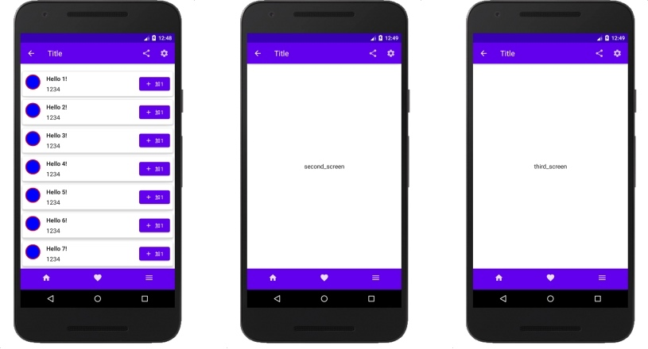
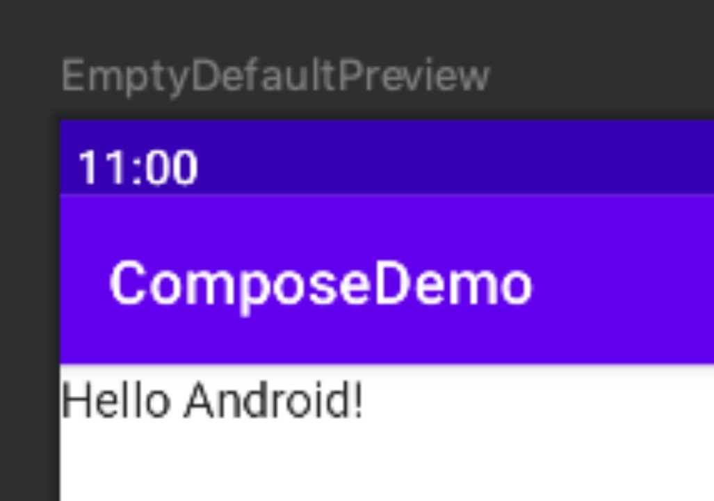

# Compose入门

#### 1. Compose
- Android Jetpack 的一个成员
- 是个特别大的UI框架，重新定义了Android UI 的写法
- 跟Flutter很像
- 去掉了xml布局，减少了加载xml耗费的时间
- 声明式UI，把界面“声明”出来，不需要手动更新
- 功能非常强大

做一个小Demo



#### 2. Hello Wrold!


```kotlin
class EmptyActivity : ComponentActivity() {

    override fun onCreate(savedInstanceState: Bundle?) {
        super.onCreate(savedInstanceState)
        setContent {
            ComposeDemoTheme {
                // A surface container using the 'background' color from the theme
                Surface(color = MaterialTheme.colors.background) {
                    EmptyGreeting("Android")
                }
            }
        }
    }
}

@Composable
fun EmptyGreeting(name: String) {
    Text(text = "Hello $name!")
}

@Preview(showBackground = true, showSystemUi = true)
@Composable
fun EmptyDefaultPreview() {
    ComposeDemoTheme {
        EmptyGreeting("Android")
    }
}

``` 

- 每个控件都是一个函数调用

- 每个界面函数都带@Composable，说明这是可组合界面函数

- 可组合界面函数，可以接受参数，把参数用在界面上

- Text(“xxx”) 是个方法，不是类，跟TextView不是一个东西

- Compose的渲染机制跟View不一样了

#### 3. Compose使用的是声明式UI
`声明式UI —— “不需要手动更新UI”`

##### 传统命令式UI

xml
```xml
<LinearLayout>
	<TextView />
	<Button />
</LinearLayout />
```

View
```kotlin
textView.text = ""
textView.isVisible = false
```

##### 声明式UI

```kotlin

var text = ""
var isShowText = false
Column {
    if(isShowText) {
        Text(text)
    }
	Button()
}
```

#### 4. 状态

怎么更新UI：
- 通过新参数调用同一个可组合项，这个参数记录了界面状态，状态发生改变时，界面会进行重组。
- 重点：记录状态的数据发生改变时，会重新运行可组可组合函数，重组UI。

```kotlin
val text = remember { mutableStateOf("") }
val isShowText = remember { mutableStateOf(false) }
```

- remember：记录数据，管理新参数的状态改变

- mutableStateOf：创建了可观察对象MutableState

- MutableState：Compose集成的可观察类型

- 可观察类型包括：MutableState、LiveData、Flow、RxJava2

- 通过读取State<T>对象来自动重组界面

- 其他可观察类型需要通过.observeAsState()转换为State，再交给可组合项读取

#### 5. 布局对比

| Android | Compose |
| :-: | :-: |
| XML Layout | @Compose 可组合函数 |
| LinearLayout、FrameLayout | Colume、Row、Box |
| ConstraintLayout | Compose的ConstraintLayout |
| RecyclerView | LazyRow、LazyColumn、LazyVerticalGrid |
| 容器的shape | Surface |
| ScrollView | Modifier.scrollable |
| onClick | Modifier.clickable |
| View的各种属性设置 | Modifier |
| 底部导航栏，顶部标题栏等结构 | Scaffold声明 |
| TextView / ImageView / Button... | Text() / Image() / Button()... |
| Context | LocalContext.current |

#### 6. Modifier

- 修改控件大小
    - size(width: Dp, height: Dp)

- 设置宽度、高度
    - width(width: Dp) / height(height: Dp)

- match_parent
    - fillMaxWidth() / fillMaxHeight()

- wrap_content
    - wrapContentSize()

- 设置padding
    - padding(all: Dp)

- 设置背景颜色、形状（默认矩形）
    - background(color: Color, shape: Shape = RectangleShape)

- 裁剪，设置为不同形状
    - clip(shape: Shape)

- 设置边框，宽度、颜色、形状
    - border(width: Dp, color: Color, shape: Shape = RectangleShape)

- 设置对齐方式
    - align(alignment: Alignment)