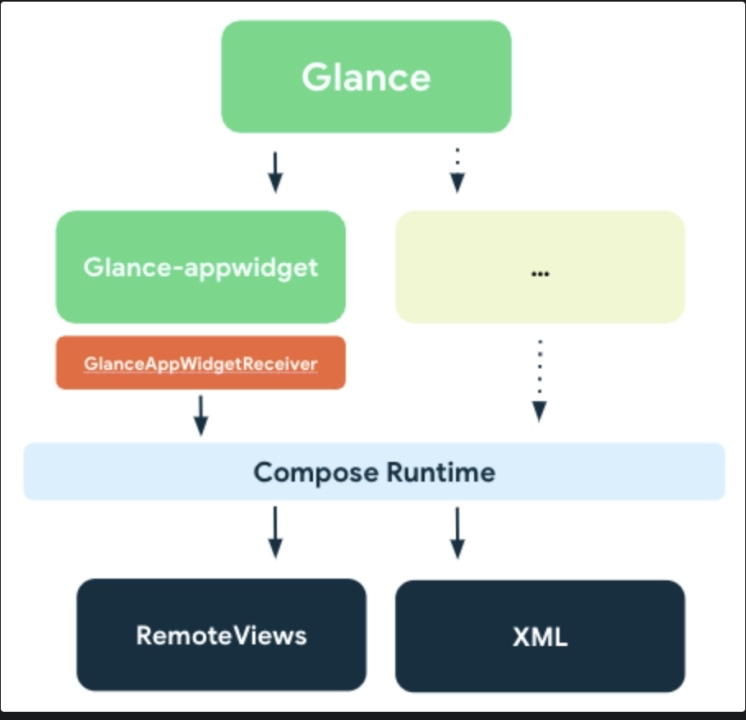

# Glance做一个小组件

### 1. Glance

- Android Jetpack 的一个成员
- 使用Compose的声明式API构架布局
- 用Compose封装了RemoteViews（底层还是RemoteViews）
- 兼容的最低安卓版本是23




### 2. 创建小组件

#### (1) 配置Reciver

```xml
<receiver
    android:name=".GlanceDemoReceiver"
    android:exported="true">
    <intent-filter>
        <action android:name="android.appwidget.action.APPWIDGET_UPDATE" />
    </intent-filter>

    <meta-data
        android:name="android.appwidget.provider"
        android:resource="@xml/glance_demo_app_widget_info" />
</receiver>
```

#### (2) 配置glance_demo_app_widget_info
```xml
<appwidget-provider xmlns:android="http://schemas.android.com/apk/res/android"
    android:description="@string/app_widget_description"
    android:minWidth="300dp"
    android:minHeight="100dp"
    android:previewImage="@drawable/example_appwidget_preview"
    android:resizeMode="horizontal|vertical"
    android:updatePeriodMillis="86400000"
    android:widgetCategory="home_screen" />
```
这里的glance_demo_app_widget_info，没有initialLayout了。

#### (3) 创建Receiver
```kotlin
class GlanceDemoReceiver :
    GlanceAppWidgetReceiver() {

    override val glanceAppWidget: GlanceAppWidget = GlanceWidget()

}
```

- GlanceAppWidget是GlanceAppWidgetReceiver里的抽象参数

- GlanceAppWidgetReceiver继承AppWidgetProvider

- 流程跟原生Widget一样

- GlanceAppWidgetReceiver封装了onUpdata()等方法，通过GlanceAppWidget实现布局

#### (4) GlanceAppWiget内编写布局
```kotlin
class GlanceWidget : GlanceAppWidget() {

    @Composable
    override fun Content() {
        Column(
            modifier = GlanceModifier
                .fillMaxSize()
                .cornerRadius(5.dp)

        ) {
            Text(
                text = "Title",
                modifier = GlanceModifier.fillMaxWidth()
            )
        }
    }
}
```

- 原Compose中用到的类，看包名都变成了ndroidx.glance.*

- modifier变成了GlanceModifier

- Text等可组合项是在glance包里的

- Glance支持的可组合项：Box、Row、Column、Text、Button、LazyColumn、Image、Spacer

- 使用与Compose大致相同，又有些不同。比如Button的onClick在Compose里是函数回调，在Glance里是Action类型

### 3. Glance的Action

#### (1) 启动Activity
```kotlin
onClick = actionStartActivity<MainActivity>()
```

#### (2) 启动Service
```kotlin
onClick = actionStartService<TestService>()
```

#### (3) 启动BroardcastReceiver
```kotlin
onClick = actionSendBroadcast<GlanceDemoReceiver>()
```

#### (4) 作为回调
```kotlin
onClick = actionRunCallback<ActionCallbacks>()

class ActionCallbacks : ActionCallback {
    override suspend fun onRun(
        context: Context,
        glanceId: GlanceId,
        parameters: ActionParameters
    ) {
        // 回调处理
    }
}
```

#### (5) Action怎么传参 —— ActionParameters
##### ① 以键值对的形式为action提供参数，Key为Glance封装好的类，value是泛型
```java
    /**
     * Key for [ActionParameters] values. Type T is the type of the associated value. The [Key.name]
     * must be unique, keys with the same name are considered equal.
     */
    public class Key<T : Any> (public val name: String) {
        /**
         * Infix function to create a Parameters.Pair.
         *
         * @param value the value this key should point to
         */
        public infix fun to(value: T): Pair<T> = Pair(this, value)

        override fun equals(other: Any?): Boolean = other is Key<*> && name == other.name

        override fun hashCode(): Int = name.hashCode()

        override fun toString(): String = name
    }
```

##### ② 使用很简单
```kotlin
onClick = actionRunCallback<ActionCallbacks>(
    parameters = actionParametersOf(ActionParameters.Key<String>("key") to "打开")
)

class ActionCallbacks : ActionCallback {
    override suspend fun onRun(
        context: Context,
        glanceId: GlanceId,
        parameters: ActionParameters
    ) {
        val value = parameters[ActionParameters.Key("key")].toString()
        Toast.makeText(context, value, Toast.LENGTH_SHORT).show()
    }
}
```

### 4. SizeMode适配布局

- SizeMode.Single：小组件只有一种布局

- SizeMode.Exact：为 App Widget 可能显示的每种尺寸提供一个 UI，尺寸是原生AppWidgetManager.getAppWidgetOptions里的尺寸

- SizeMode.Responsive：安卓12以上可用，为一组自定义的固定大小提供UI



