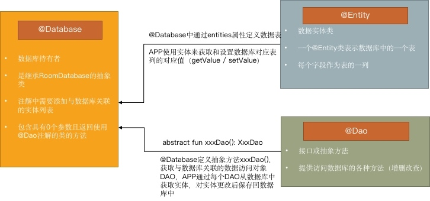
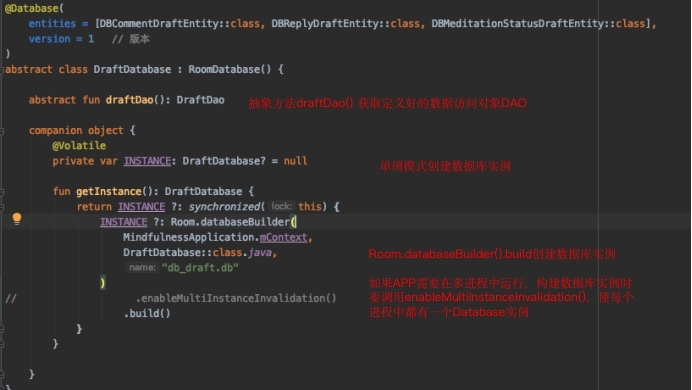
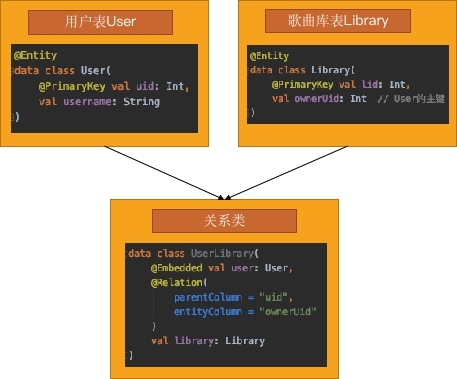
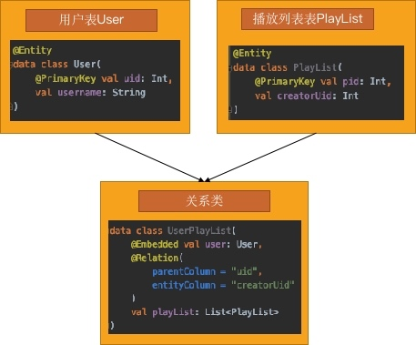
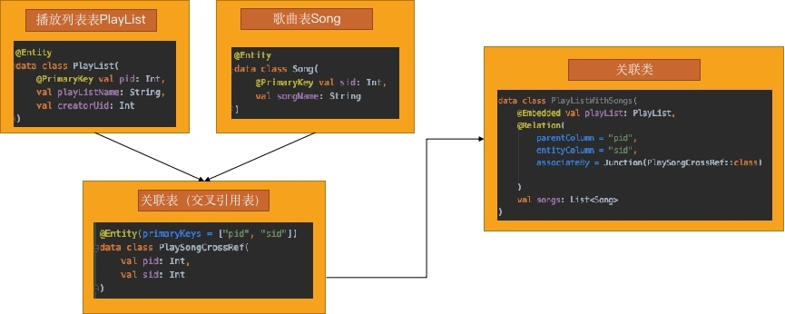
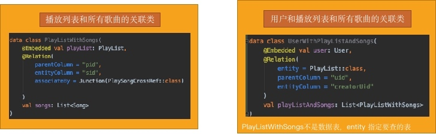

# Room数据库的使用

Room是在SQLite上提供了一个抽象层，在充分利用SQLite的强大功能上，更流畅更方便地访问数据库

### 1.Room的三个组件



</br>

### 2. 创建数据库实例



@Database：数据库持有者
- entities 定义数据库含有的表

- version 定义数据库版本号

- views 定义视图

- exportSchema 为true时将数据库配置的json文件导出到room.schemaLocation配置的地址(在build.gradle中可配置)


</br>

### 3. 用实体类定义数据表

#### (1) @PrimaryKey定义主键

##### ① 自动ID
```kotlin
@Entity 
data class User( 
	@PrimaryKey(autoGenerate = true) var id: Int, 
	var firstName: String?, 
	var lastName: String? 
)
```

##### ② 复合主键
```kotlin
@Entity(primaryKeys = arrayOf("firstName", "lastName"))
data class User(
    val firstName: String?,
    val lastName: String?
)
```

##### ③ 不同于类名/属性名的名称
```kotlin
@Entity(tableName = “users”)
data class User(
    @PrimaryKey(autoGenerate = true) var id: Int, 
    @ColumnInfo(name = “first_name”) var firstName: String?, 
    var lastName: String? 
))
```

#### (2) @Ignore定义不想储存的字段
##### ① 定义实体类中不想存储的字段
```kotlin
@Entity 
data class User( 
	@PrimaryKey(autoGenerate = true) var id: Int, 
	var firstName: String?, 
	var lastName: String? 
	@Ignore val avatar: String?   // 不存储
)
```

##### ② 继承父类时，定义不想存储的父类的某个字段

```kotlin
open class User {
	 var avatar: String? = null
 }

@Entity(ignoredColumns = arrayOf("avatar")) 
data class RemoteUser( 
	@PrimaryKey val id: Int, 
	val isVip: Boolean 
) : User()
```

</br>

### 4. 定义对象之间的关系
#### (1) 一对一关系
限制：
- 一个用户只能有一个歌曲库
- 一个歌曲库只能对应一个用户

需求：
- 显示所有用户和他们的歌曲库

步骤:
- 查询所有用户
- 根据User的uid查询对应的Library
- 处理映射关系 



注解说明：
- @Embedded：
    - 表示将user字段标记为嵌套字段，user的字段在SQL查询中可以被直接引用
    - 嵌套字段还可以包括别的嵌套字段

- @Relation：
    - Library拥有User的信息，所以@Relation加在library变量上
    - 指定父实体User表的uid与子实体Library表的ownerUid对应

#### (2) 一对多关系
限制：
- 一个用户可以创建多个播放列表
- 一个播放列表只能由一个用户创建

需求：
- 显示所有用户和他们的播放列表

步骤：
- 查询所有用户
- 根据User的uid查询对应的PlayList
- 处理映射关系



此时可以简化DAO语句：
```kotlin
@Transaction
@Query("SELECT * FROM user")
fun getUsersAndPlayLists(): List<UserPlayList>
```
Room 会自动执行两次查表操作 </br>
@Transaction注解保证原子性（两次查表一起成功或一起失败）

与一对一关系的区别：子实体的返回类型为列表

#### (3) 多对多关系

限制：
- 每个播放列表都可以有多首歌
- 每首歌都可以加入不同的播放列表

需求：
- 查询所有播放列表及其包含的所有歌曲
- 查询所有歌曲及包含它的所有播放列表




- 查询所有播放列表及其包含的所有歌曲
    - @Relation标注在songs变量上；
- 查询所有歌曲及包含它的所有播放列表
    - @Relation标注在playLists变量上
- Junction
    - 声明用于连接关系的表
    - 关联类取决于想查询的实体类

此时可以简化DAO语句：
```kotlin
/**
* 查询所有播放列表及其包含的所有歌曲
**/
@Transaction
@Query("SELECT * FROM playlist")
fun getPlayListsWithSongs(): List<PlayListWithSongs>
```

#### (4) 嵌套关系

限制：
- 两个以上的表格集合，这些表格之间互相关联

需求：
- 查询所有用户、每个用户的所有播放列表以及每个用户的每个播放列表的所有歌曲



注解说明：
- @Relation：实现对象之间的各种关系
    - parentColumn：指定父实体的关联字段
    - entityColumn：指定子实体的关联字段
    - associateBy：通过@Junction指定对象之间的关联表

- entity：指定要查询的数据表
- projection：指定要返回的具体字段

</br>

### 5. DAO访问数据

Room默认不允许在主线程访问数据库，非异步查询必须在子线程操作
构造数据库时调用`allowMainThreadQueries()`，可以支持在主线程访问数据库

#### (1) 增
```kotlin
@Insert(onConflict = OnConflictStrategy.REPLACE)
fun insertUsers(vararg users: User)
```

注解说明：
- @Insert：插入数据
- onConflict：指定插入数据遇到冲突的处理方式（默认为Abort回滚）
- entity：可指定操作的表 

#### (2) 删
```kotlin
@Update
fun updateUsers(vararg users: User)
```

注解说明：
- @Update：修改数据（通过主键匹配）
- onConflict：指定插入数据遇到冲突的处理方式（默认为Abort回滚）
- entity：可指定操作的表 

#### (3) 改
```kotlin
@Delete
fun deleteUsers(vararg users: User)
```
注解说明：
- @Delete：删除数据（通过主键匹配）
- entity：可指定操作的表 

#### (4) 查

注解说明：
- @Query
    - 根据填入的SQL语句对数据库进行读/写操作
    - 编译时会对每个@Query方法进行验证，如果返回对象的字段与查询对象的字段完全不匹配，编译时会报错

##### ① 简单查询
```kotlin
@Query("SELECT * FROM user")
fun getAllUsers(): List<User>
```
##### ② 传递参数
```kotlin
// 模糊搜索用户名
@Query("SELECT * FROM user WHERE usersname LIKE :userName")
fun searchUser(userName: String): List<User>

// 查询从某些省份来的用户列表
@Query("SELECT * FROM user WHERE region IN (:regions)")
fun getUserFromRegions(regions: List<String>): List<User>
```
##### ③ 返回列的子集
```kotlin
data class SimpleUser(
    val username： String?,
    val age: Int
)

@Query("SELECT username, age FROM user")
fun getNameAndAge(): List<SimpleUser>
```
##### ④ 删除
```kotlin
@Query("DELETE FROM user WHERE username LIKE :username")
fun deleteUser(username: String)
```

</br>
### 6. DAO查询访问类型
#### (1) RxJava
- @Query：支持Publisher、Flowable、Observable类型的返回值
- @Insert、@Update、@Delete：Room2.1.0以上版本支持Completable、Single、Maybe类型的返回值

添加room-rxjava2依赖：
```
dependencies {
    def room_version = "2.1.0"
    implementation 'androidx.room:room-rxjava2:$room_version'
}
```

```kotlin
@Query("SELECT * FROM user WHERE uid = :id")
fun loadUserById(id: Int): Observable<User>
```

#### (2) LiveData

- 可观察查询
- 当数据库更新时，LiveData能监听到数据发生变化，应用的界面可以在数据发生变化时自动更新

```kotlin
// DAO
@Query("SELECT * FROM user WHERE uid = :id")
fun loadUserById(id: Int): LiveData<User>

// View层监听
dao.loadUserById(id).observe(this) {
    // ...
}
```

#### (3) 协程
- 使用协程功能使DAO的方法成为异步方法

```kotlin
@Query("SELECT * FROM user WHERE uid = :id")
suspend fun loadUserById(id: Int): User
```

#### (4) Flow
- 只要表数据发生变化（任何行，无论该行是否在结果集内），返回的Flow对象会再次触发查询并重新发出整个结果集
- distinctUntilChanged()可以确保在实际查询结果发生变化时才通知界面

```kotlin
@Query("SELECT * FROM user WHERE uid = :id")
fun loadUserById(id: Int): Flow<User>
```

</br>

### 7. 数据库升级
- 通过Migration类进行增量迁移
- 如果Room没有找到将设备上的现有数据库升级到当前版本的迁移路径，会抛出异常IllegalStateException
- 如果此时可以接受数据丢失，创建数据库时可调用 fallbackToDestructiveMigration()方法
- 表示找不到版本升级迁移路径时，重新创建应用的数据库表

```kotlin
@Database(
    entities = [DBCommentDraftEntity::class, DBReplyDraftEntity::class, DBMeditationStatusDraftEntity::class],
    version = 2   // 版本
)
abstract class DraftDatabase : RoomDatabase() {

    abstract fun draftDao(): DraftDao

    companion object {
        
        private val MIGRATION_1_2 = object: Migration(1, 2) {
            override fun migrate(database: SupportSQLiteDatabase)   {
                database.execSQL("ALTER TABLE user ADD COLUMN avatar TEXT")
            }
        }
        
        @Volatile
        private var INSTANCE: DraftDatabase? = null

        fun getInstance(): DraftDatabase {
            return INSTANCE ?: synchronized(this) {
                INSTANCE ?: Room.databaseBuilder(
                    MindfulnessApplication.mContext,
                    DraftDatabase::class.java,
                    "db_draft.db"
                )
                .addMigrations(MIGRATION_1_2)
                .build()
            }
        }

    }
}
```

