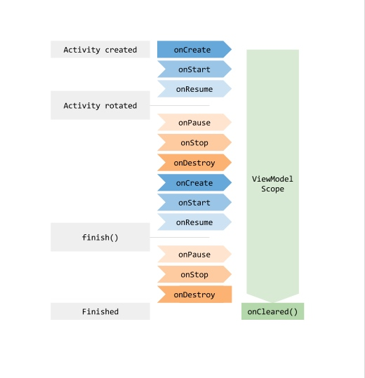

# ViewModel原理

### 1. ViewModel是什么

[官网链接](https://developer.android.com/topic/libraries/architecture/viewmodel?hl=zh-cn#lifecycle)

```
ViewModel 类旨在以注重生命周期的方式存储和管理界面相关数据。
ViewModel 类让数据可在发生屏幕旋转等配置更改后继续留存。

ViewModel 对象的作用域限定为获取 ViewModel 时传递给 ViewModelProvider 的 ViewModelStoreOwner 的 Lifecycle。
ViewModel 将一直留在内存中，直到其作用域 ViewModelStoreOwner 永久消失
```

简单来说，ViewModel是用来保存UI数据的。

#### 官网的例子：屏幕旋转



如图，ViewModel在整个屏幕旋转的生命周期内都处于一个状态，当UI销毁（Activity Finished）时，才会调用onCleared()清除数据。

### 2. 原理

##### ① 代码中获取ViewModel实例：
```kotlin
private val viewModel by lazy { ViewModelProvider(this).get(MainViewModel::class.java) }
```
</br>

##### ② 对应看到ViewModelProvider的构造方法
```kotlin
public constructor(
        owner: ViewModelStoreOwner
) : this(owner.viewModelStore, defaultFactory(owner), defaultCreationExtras(owner))
```
调用了ViewModelProvider自己的构造方法，传进去一个`ViewModelStoreOwner.viewModelStrore`，创建了默认的工厂。

</br>

##### ③ 再看到ViewModelProvider#get()
```kotlin
public open operator fun <T : ViewModel> get(modelClass: Class<T>): T {
    val canonicalName = modelClass.canonicalName
        ?: throw IllegalArgumentException("Local and anonymous classes can not be ViewModels")
    return get("$DEFAULT_KEY:$canonicalName", modelClass)
}
```
给下一步的get()传入了一个默认的key。

```kotlin
public open operator fun <T : ViewModel> get(key: String, modelClass: Class<T>): T {
    val viewModel = store[key]
    if (modelClass.isInstance(viewModel)) {
        (factory as? OnRequeryFactory)?.onRequery(viewModel)
        return viewModel as T
    }
    // ...
    // 最终调用了factory.create()
    return try {
        factory.create(modelClass, extras)
    } catch (e: AbstractMethodError) {
        factory.create(modelClass)
    }.also { store.put(key, it) }
}
```

在get()方法中，首先根据key，从store[]中获取ViewModel对象。</br>
判断如果类型正确，返回当前对象。</br>
否则，调用factory.create()，创建新的ViewModel对象。

</br>

##### ④ 工厂中创建ViewModel

factory.create()，factory指向的是实例化ViewModelProvider时传入的defaultFactory。

Android最终创建的默认工厂是`NewInstanceFactory`

```java
public static class NewInstanceFactory implements Factory {

    private static NewInstanceFactory sInstance;

    @Override
    public <T extends ViewModel> T create(@NonNull Class<T> modelClass) {
        //noinspection TryWithIdenticalCatches
        try {
            return modelClass.newInstance();
        } catch (InstantiationException e) {
            throw new RuntimeException("Cannot create an instance of " + modelClass, e);
        } catch (IllegalAccessException e) {
            throw new RuntimeException("Cannot create an instance of " + modelClass, e);
        }
    }
}
```

factory.create()，最终通过modelClass.newInstance()创建ViewModel实例。

</br>

##### ⑤ store，存储ViewModel实例
store，即ViewModelStore。
```java
public class ViewModelStore {

    private final HashMap<String, ViewModel> mMap = new HashMap<>();

    final void put(String key, ViewModel viewModel) {
        ViewModel oldViewModel = mMap.put(key, viewModel);
        if (oldViewModel != null) {
            oldViewModel.onCleared();
        }
    }

    final ViewModel get(String key) {
        return mMap.get(key);
    }

    Set<String> keys() {
        return new HashSet<>(mMap.keySet());
    }


    public final void clear() {
        for (ViewModel vm : mMap.values()) {
            vm.clear();
        }
        mMap.clear();
    }
}
```

ViewModelStore内部，通过HashMap来存储ViewModel对象，提供了clear()方法清除所有的ViewModel。

ViewModelStore，在ViewModelProvider实例化时，通过`viewModelStoreOwner.viewModelStore`传入。

</br>

##### ⑥ 来到ViewModelStoreOwner，就到了我们熟悉的Activity、Fragment
ViewModelStoreOwner是一个接口。
```java
public interface ViewModelStoreOwner {

    @NonNull
    ViewModelStore getViewModelStore();
}
```
</br>

继续追踪，发现ComponentActivity实现了这个接口。
```java
@NonNull
@Override
public ViewModelStore getViewModelStore() {
    //...
    ensureViewModelStore();
    return mViewModelStore;
}
```

</br>

ensureViewModelStore()，顾名思义是确保ViewModelStore不为空的方法。
```java
void ensureViewModelStore() {
    if (mViewModelStore == null) {
        NonConfigurationInstances nc =
                (NonConfigurationInstances) getLastNonConfigurationInstance();
        if (nc != null) {
            // Restore the ViewModelStore from NonConfigurationInstances
            mViewModelStore = nc.viewModelStore;
        }
        if (mViewModelStore == null) {
            mViewModelStore = new ViewModelStore();
        }
    }
}
```

</br>

##### ⑦ Activity中UI数据存储与获取
从`ensureViewModelStore()`中看到，Activity先调用`getLastNonConfigurationInstance()`获取NonConfigurationInstances对象，nc不为空则获取nc中的viewModelStore，nc为空则创建新的ViewModelStore对象。

###### 首先看到Activity#getLastNonConfigurationInstance
```java
public Object getLastNonConfigurationInstance() {
    return mLastNonConfigurationInstances != null
            ? mLastNonConfigurationInstances.activity : null;
}
```
根据官方注释，
这个方法会返回之前由`onRetainNonConfigurationInstance()`保存的非配置实例数据。</br>
可以在Activity的生命周期onCreate()和onStart()中调用。</br>
所以，这个方法的作用就是获取存储的数据。

</br>

###### 再看到Activity#onRetainNonConfigurationInstance 
```java 
public Object onRetainNonConfigurationInstance() {
    return null;
}
```
根据官方注释，这个方法由系统调用，在Activity因为配置更改而销毁时，保存一些非配置实例数据。</br>
这个方法在onStop()和onDestroy()之间调用。</br>
所以，这个方法的作用是在Activity销毁时存储信息。

</br>

###### 再到ComponentActivity#onRetainNonConfigurationInstance

```java
public final Object onRetainNonConfigurationInstance() {
    // 已弃用
    Object custom = onRetainCustomNonConfigurationInstance();

    ViewModelStore viewModelStore = mViewModelStore;
    if (viewModelStore == null) {
        // No one called getViewModelStore(), so see if there was an existing
        // ViewModelStore from our last NonConfigurationInstance
        // 看看有没有保存的nci数据
        NonConfigurationInstances nc =
                (NonConfigurationInstances) getLastNonConfigurationInstance();
        if (nc != null) {
            viewModelStore = nc.viewModelStore;
        }
    }

    // 没有就直接返回null
    if (viewModelStore == null && custom == null) {
        return null;
    }
    
    // 有就重新创建nci，保存viewModelStore
    NonConfigurationInstances nci = new NonConfigurationInstances();
    nci.custom = custom;
    nci.viewModelStore = viewModelStore;
    return nci;
}
```

</br>

##### ⑧ 数据的释放

ComponentActivity中，监听了Activity的生命周期，在ON_DESTROY的时候，调用了viewModelStore的clear()，将保存的viewModel对象全部清空。

```java
getLifecycle().addObserver(new LifecycleEventObserver() {
    @Override
    public void onStateChanged(@NonNull LifecycleOwner source,
            @NonNull Lifecycle.Event event) {
        if (event == Lifecycle.Event.ON_DESTROY) {
            // Clear out the available context
            mContextAwareHelper.clearAvailableContext();
            // And clear the ViewModelStore
            if (!isChangingConfigurations()) {
                getViewModelStore().clear();
            }
        }
    }
});
```

### 3. 总结

- ViewModel通过ViewModelProvider获取实例，传入了一个ViewModelStore和一个默认的工厂类。
- 最终是通过工厂类创建ViewModel对象。
- ViewModelStore维护了一个HashMap，用来存储当前持有者（Activity/Fragment...）所创建的ViewModel对象。
- 下次要用时会先从ViewModelStore的HashMap中，根据key获取ViewModel对象。
- ViewModelStoreOwner是个接口，在ComponentActivity中实现，覆写了getViewModelStore()
- 最后页面销毁的时候，会调用viewModelStore的clear()清除所有ViewModel数据。
- 当屏幕旋转等配置更改导致activity重建时
    - activity会在onStop和onDestroy之间调用onRetainNonConfigurationInstance()保存数据，把viewModelStore保存下来
    - 再在onCreate之后调用getLastNonConfigurationInstance()恢复数据
    - 再次通过ViewModelProvider(owner).get()获取对应ViewModel的时候，会从getLastNonConfigurationInstance()方法获取保存下来的viewModelStore

- 通过ViewModelProvider(owner).get()，传入相同的owner，也可以实现Activity、Fragment之间的数据共享。因为同一个owner获取到的是相同的viewModel对象。
