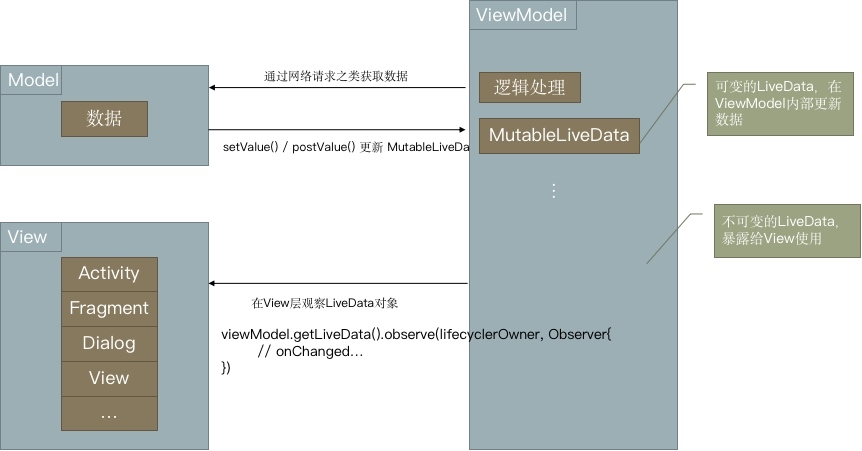
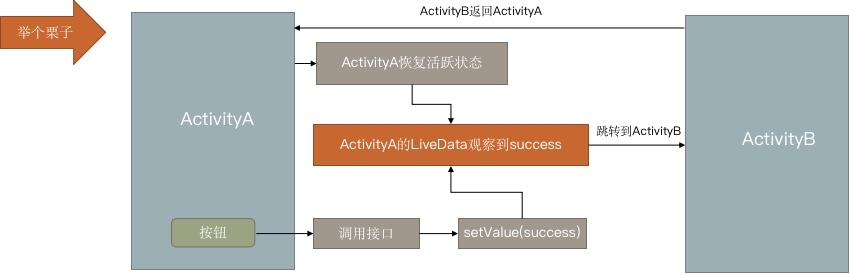

# 记录LiveData的一个坑

### 1.LiveData简介
- Jetpack的一部分
- 是一种可观察的数据存储器类
- 可以感知生命周期，确保LiveData仅更新处于活跃生命周期状态的应用组件观察者
- 遵循观察者模式，观察者可以在每次发生变更时更改界面
- 不会发生内存泄露：观察者是跟Lifecycle绑定的
- 不会因Activity的停止而崩溃：观察者的生命周期处于非活跃状态，不会受到任何LiveData事件
- 不需要手动处理生命周期：LiveData会自动管理
- 数据始终保持最新状态：生命周期从非活跃到活跃状态时，会接收最新的数据
- 适当的配置更改：如果由于配置更改（如屏幕旋转）重新创建了Activity，会立即接收到最新的可用数据
- 共享资源：用单例模式扩展LiveData，可用在应用中共享数据

</br>

### 2. LiveData在MVVM中的应用


</br>

### 3.遇到的坑

#### (1) 问题
数据始终保持最新状态：生命周期从非活跃到活跃状态时，会接收最新的数据

- 有些数据可能只需要显示一次
- 上述LiveData的优点，会导致Activity在非活跃状态恢复活跃状态时，观察者再次收到最后一次setValue的数据，导致数据重复显示
- 比如：显示一个Toast，显示一个Dialog，跳转到另外的Activity



</br>

#### (2) 一些不太好的解决方案

##### ① 在更新完数据之后立即将数据置为空或闲置状态

``` kotlin
fun success() {
	mutableLiveData.setValue(success)
	mutableLiveData.setValue(idle)
}
```

问题：
- 别人可能看不懂
- 多线程中操作，可能会发生抢夺资源，导致部分数据没有发送成功

</br>

##### ② 在观察者观察到数据后，将数据置为空或闲置状态

```kotlin
fun success() {
	mutableLiveData.setValue(success)
}

fun reset() {  // 观察者观察到success后调用
	mutableLiveData.setValue(idle)
}
```

问题:
- ViewModel中不是每个事件都能对应同一个初始状态（闲置状态），添加多个容易出错
- 观察者容易忘记调用ViewModel的重置方法

</br>

#### (3) 用只发送一次数据的SingleLiveEvent

```kotlin
class SingleEventLiveData<T> : MutableLiveData<T>() {

    private val mPending = AtomicBoolean(false)

    override fun observe(owner: LifecycleOwner, observer: Observer<in T>) {
        super.observe(owner, Observer {
            if (mPending.compareAndSet(true, false)) { // 为true时，才修改为false
                observer.onChanged(it) // 触发变更
            }
        })
    }

    override fun setValue(value: T) {
        mPending.set(true) // 设置为true，要处理事件
        super.setValue(value)
    }

}
```

</br>

- 创建仅发送一次更新的LiveData，使observer的onChanged方法只调用一次

- setValue()时AtomicBoolean对象mPending设为true

- observe被调用时，如果mPending为true，说明数据有更新，执行onChanged()，并重置mPending为false

- 当观察者的生命周期从非活跃状态恢复活跃状态时，并没有调用setValue()，此时mPending还是false，observer不执行onChanged()
