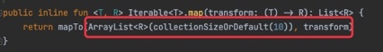
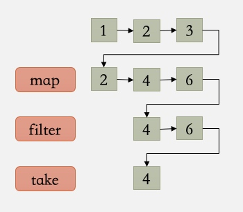
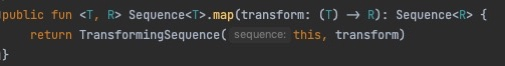
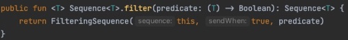
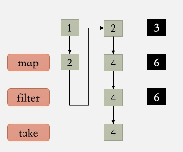

# Kotlin - Sequence序列

### Sequence是什么

- Kotlin集合容器的一种

- 可以使用Kotlin的集合操作符，如map，filter等等

- 是一种延迟计算的集合，又称惰性集合操作

</br>

### Iterable vs Sequence

- 接口定义是一样的，只有iterator()

- 操作集合时，执行过程不同

- 数据多的情况下，Sequence性能比Iterable好很多

    
</br>

#### Iterable 的执行过程

- 每遇到一个操作符，都会创建新的存储空间来保存结果

- 产生的新的数组列表传给下一个操作符

        

</br>

- 缺点
    - 浪费内存：因为通常的业务逻辑只需要最后的结果，不需要知道中间的过程
    - 数据多的情况，执行速度慢：每个操作符都是一次循环

</br>

如：

```kotlin
    (1..3)
        .asIterable()
        .map{ it * 2 }
        .filter{ it > 2 }
        .take(1)
```

执行过程：



    
</br>

#### Sequence 的执行过程

- 遇到中间操作符不会执行

- 将数据添加到待执行操作列表中，够吃一个待执行的调用链

- 遇到终端操作符才开始执行（forEach，toList等）

</br>

map:



filter:



- TransformingSequence、FilteringSequence都是Sequence的子类

- 重写了Sequence的iterator()，在Iterator的next()与hasNext()进行对应的集合数据操作

如：

```kotlin
    (1..3)
        .asSequence()
        .map{ it * 2 }
        .filter{ it > 2 }
        .take(1)
```

执行过程：



黑底的步骤不再执行。
  
</br>

### 创建一个Sequence

- 列出元素：`sequenceOf(1, 2, 3)`

- Iterable转换：`(1..3).asSequence()`

- generateSequence
    - seed为第一个元素，nextFunction生成下一个元素
    - 可能生成无限序列，如：generateSequence(1){ it + 1 }
    - 当nextFunction返回值为null时，停止生成序列

``` kotlin
fun <T : Any> generateSequence(seed: T?, nextFunction: (T) -> T?): Sequence<T>
```

- sequence()
    - 将任意大小的组块生成Sequence

```kotlin
sequence(@BuilderInference block: suspend SequenceScope<T>.() -> Unit): Sequence<T>
```

``` kotlin
sequence {
    yield(1)
    yieldAll(listOf(2, 3))
}
```

</br>

### 什么时候使用Sequence

- 数据量大
- 需要对数据进行频繁操作，链接多个操作符
- 使用first，last操作符与其他操作符结合时
- 递归中使用


