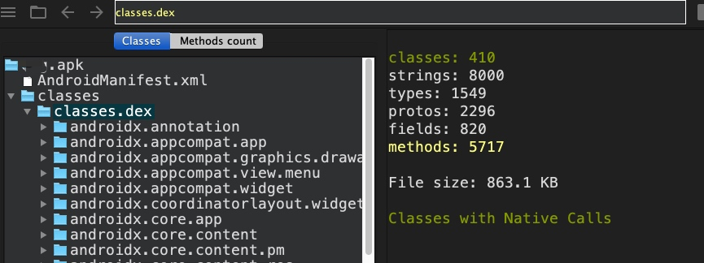
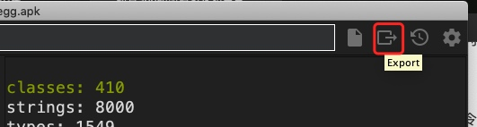
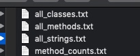

# 分析App信息

#### 缘由

隐私合规要求在隐私协议上列出所有用到的SDK和第三方库。有一些SDK内置了别的SDK，且没有在官网列出来。

#### 1. dependencies 命令

终端进入项目根目录，输入命令，将依赖输出为txt文件。

```
./gradlew app:dependencies >depen.txt 
```

#### 2. ClassyShark工具

ClassyShark是谷歌开发的APP分析工具。

[下载地址](https://github.com/google/android-classyshark/releases)
[使用文档](https://github.com/google/android-classyshark/blob/master/CommandLine.pdf)

使用命令：
```
java -jar ClassyShark.jar -open xx.apk    
```

如图：



点击右上角导出：



可将所有类、方法导出成txt：



根据类名包名，可得APP导入的所有SDK与第三方库。