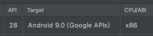
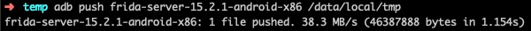
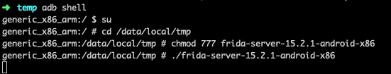
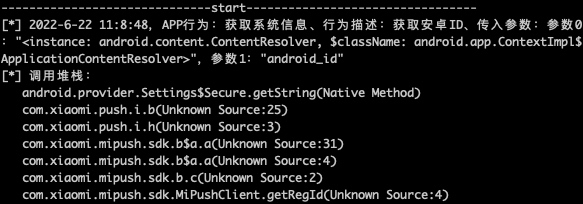

# 记录一个隐私合规检测工具 Camille

### 1. 准备测试机

- 真机需要Root

- 或者使用虚拟机
    - 需要选择`Google APIs`版的，有root
    - `Google play`版的是没有root的，后面会报错

            


### 2.测试机中安装运行frida服务

- 下载 [frida-server](https://github.com/frida/frida/releases)
    - 选择`frida-server-版本号-android-xxx.xz`下载，注意后缀与测试机CPU架构相同
    - 如，上面选择的测试机是x86，下载`frida-server-15.2.1-android-x86`
    - 解压文件，传入手机

    ```
        adb push frida-server-15.2.1-android-x86 /data/local/tmp
    ```

    


- 启动frida-server

    ```
    adb shell   //进入测试机Shell
    su          // 获取Root
    chmod 777 frida-server-15.2.1-android-x86  // 赋予权限
    ./frida-server-15.2.1-android-x86   // 启动
    ```
    
    

    
### 3. Mac安装frida工具

- Camille中使用了frida，不安装的话无法运行Camille，会报错`ModuleNotFoundError: No module named 'frida'`

命令行中输入:

```
pip3 install frida-tools
```

### 4. Mac安装运行Camille

- [Camille-github](https://github.com/zhengjim/camille)

- 新开命令行窗口，原来在测试机Shell中运行了frida服务的不能关

```
git clone https://github.com/zhengjim/camille.git
cd camille
pip3 install -r requirements.txt
python3 camille.py -h
```

- 开始检测

```
python3 camille.py 应用包名
```

- 执行后可以看到测试机中对应应用已启动，操作APP，会打印出APP的行为及堆栈信息




- 如果执行报错`超时`，加参数 -t 延时

```
python3 camille.py 应用包名 -t 3
```

