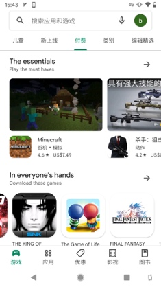

# 谷歌支付接入流程及踩坑

### 接入SDK（主要看官网）

- 官网文档：https://developer.android.google.cn/google/play/billing

- 做好准备
    - 开发者账号设置付款资料
    - 需要先在测试轨道发布一个包含 Google Play 结算库的包
    - 谷歌后台创建和配置商品
    - 添加测试人员

- 集成SDK
    - 初始化；连接GooglePlay；查询可购买的商品或订阅；购买；购买后的处理

</br>

### 在测试轨道发布一个包含 Google Play 结算库的包

- 上传release包，关闭debuggable
- 导入结算库，manifest增加权限

```
<uses-permission android:name="com.android.vending.BILLING" />
```

- app bundle 说明
    - 上传aab，会提示需要加入`Play App Signing`计划，由 Google Play 给应用签名；
    
    - 如果直接用原来的签名打包aab，会提示签名不对
    
    - 解决：生成签名 bundle 包时，勾选 `Export encrypted key`，将生成的*.pepk文件上传到 Google Play 后台，如图
    
    - 官网：https://developer.android.com/studio/publish/app-signing#enroll_existing
    
           

- 后续测试不需要重新上传，但要保证安装的apk签名、包名与上传的aab一致，版本号大于等于上传的包的版本号
- 关闭google play 自动升级软件，否则在开发过程中，如果因为改bug等原因发布了新包到google play，自动更新后需要重新上传测试渠道的包。

</br>

### In-app Billing API version is less than 3
`说明：接入完成后，连接google play失败，提示In-app Billing API version is less than 3`

- 不是SDK版本问题

通常是以下原因：
- 检查是否美区账号
- Play 商店是否能看到付费应用(国内的账号看不到)

 


以下两点有可能，但没认证：
- VPN对应的国家是否在应用发布范围内
- Google Play 版本是否很旧

</br>

### 提示商品不可购买
`说明：能拉起谷歌支付弹窗，但提示商品不可购买，通常是因为商品是测试商品，只有测试人员才能购买。`

- 确保使用的账号在测试人员里
    - 后台生成的测试邀请链接，需要用测试的谷歌账号点进去同意参加测试
    - 加入后能在google play看到测试版的app
    
    


- 确保使用支付的谷歌账号是测试账号
    - 必须在测试人员的 Android 设备上设置测试帐号。
    - 如果设备上有多个帐号，会使用下载应用时所用的帐号进行购买。
    - 如果没有帐号下载过应用，会使用第一个帐号进行购买。

</br>

### 如何不绑定银行卡进行测试
`说明：有些资料表示必须绑定支持海外支付的银行卡才能测试支付，其实可以使用测试卡`

使用测试卡的条件：
- 已发布测试版本（内测/封测）
- 将订单变成测试订单
    - 需要在Google Play [Console控制台](https://play.google.com/apps/publish) 中的设置->开发者账号->账号详情->许可测试填写"可用于测试的 Gmail帐号", 填写测试账号, 多个的话用逗号分割, 保存
    - 之后拉起支付页面，就可以看到测试卡
   
   

</br>

### 测试
[官网](https://developer.android.com/google/play/billing/test?hl=zh-cn) 有详细测试说明、测试用例。
注意添加许可测试人员。

</br>

### 支付流程（与支付宝微信不一样的地方）
- 1、BillingClient初始化，传入购买状态更新监听

- 2、连接谷歌服务器，client.startConnection

- 3、查询可购买商品详情，client.querySkuDetails，获取SkuDetails

- 4、购买，client.launchBillingFlow，调起支付页面

- 5、监听到支付成功，调用服务器接口验证订单，验证成功会扣款

- 6、购买成功，消耗商品/确认订单
    - 内购商品，购买后要调用client.consumePurchase消耗商品
    - 订阅，生成订单后要调用client.acknowledgePurchase确认订单
    - 如果没有确认，谷歌会自动退款

- 7、续订同步
    - 续订不会产生新的purchase，client.queryPurchase查不到续订的订单，需要后端接收谷歌的通知回调（好像免费次数有限制），再同步订单数据

- 另外，服务器验证商品需要翻墙，可能存在响应时间久的情况，加个loading会比较好...

</br>

### 其他
`说明：没遇到过，但是在别人写的文章里看到过`
- 上传的包超过50MB要分包

- querySkuDetails查询商品，返回的商品列表一直为空：包还没过审

- 内购报错（billing‘s responseCode :4）：Play商店登录了多个账号

- 内购报错（billing‘s responseCode :3 商品查询不到）：传的skuId与谷歌后台配置的productid不一致

- 商品配置要将商品状态改为激活状态，否则会一直提示需要登录

- IabResult: Error checking for billing v3 support. (response: 3:Billing Unavailable)没登录谷歌账号
