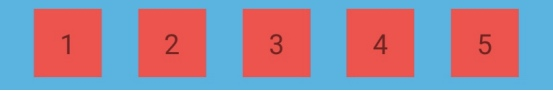

# ConstraintLayout有用的特性

### 1. GuideLine
- 创建相对于当前ConstraintLayout的准线，通过准线来定位View的布局。

```
 layout_constraintGuide_begin：距离父控件起始位置的距离（左侧/顶部）
 layout_constraintGuide_end：距离父控件结束位置的距离（右侧/底部）
 layout_constraintGuide_percent：距离父控件宽度或高度的百分比（取值范围0~1） 
```

### 2. Barrier
- Barrier，即 `障碍物、界限` ; 

- 与 GuideLine 的作用有点像，但更加灵活，可以约束多个View

#### (1) 用法
- `constraint_referenced_ids` 设置依赖的控件id

- `barrierDirection` 控制界限位于依赖控件的哪个位置，取值有 `top̵ bottom̵ left̵ right̵ start̵ end`

#### (2) 例子：


##### ① 一般做法：将两个EditText对齐

```xml
<TextView
    android:id="@+id/tvName"
    android:text="姓名："
    app:layout_constraintTop_toTopOf="parent"
    app:layout_constraintStart_toStartOf="parent"/>

<EditText
    android:id="@+id/etName"
    app:layout_constraintBaseline_toBaselineOf="@id/tvName"
    app:layout_constraintStart_toStartOf="@id/etPhone"/>
    
<TextView
    android:id="@+id/tvPhone"
    android:text="联系方式："
    app:layout_constraintTop_toBottomOf="@id/tvName"
    app:layout_constraintStart_toStartOf="@id/tvName"/>

<EditText
    android:id="@+id/etPhone"
    app:layout_constraintBaseline_toBaselineOf="@id/tvPhone"
    app:layout_constraintStart_toEndOf="@id/tvPhone"/>
```

##### ② 问题：如果多语言将中文换成英文，TextView的长度不一样了，就对不齐了。


##### ③ 使用Barrier
```xml
<androidx.constraintlayout.widget.Barrier
    android:id="@+id/barrier"
    android:layout_width="wrap_content"
    android:layout_height="wrap_content"
    app:barrierDirection="end"
    app:constraint_referenced_ids="tvName,tvPhone"/>
    
<TextView
    android:id="@+id/tvName"
    android:text="usernameғ "
    app:layout_constraintTop_toTopOf="parent"
    app:layout_constraintStart_toStartOf="parent"/>
    
<EditText
    android:id="@+id/etName"
    app:layout_constraintBaseline_toBaselineOf="@id/tvName"
    app:layout_constraintStart_toEndOf="@id/barrier"/>
    
<TextView
    android:id="@+id/tvPhone"
    android:text="phoneғ "
    app:layout_constraintTop_toBottomOf="@id/tvName"
    app:layout_constraintStart_toStartOf="@id/tvName"/>
    
<EditText
    android:id="@+id/etPhone"
    app:layout_constraintBaseline_toBaselineOf="@id/tvPhone"
    app:layout_constraintStart_toEndOf="@id/barrier"/>
```

效果：


### 3. Group

- 通过设置 `constraint_referenced_ids` 将一组View加入到Group，直接控制Group的 visibility 属性来控制一组View的可见性；
- 当使用多个Group时，不要将同一个View加入不同的Group，可能会导致控制该View的显示隐藏失效。

#### (1) 用法
```xml
<androidx.constraintlayout.widget.Group
    android:id="@+id/group"
    android:layout_width="wrap_content"
    android:layout_height="wrap_content"
    android:visibility="gone"
    app:constraint_referenced_ids="tv1,tv2,tv3"/>
```

在代码中控制显示隐藏：
```kotlin
group.visible = true
group.visible = false
```

### 4. Layer

- Layer，即`层`，可以理解为它引用的View的边界，会包裹住它引用的所有View;
- 可以通过Layer直接给一个界面中的部分View设置背景，或给几个View设置一样的动画。

#### (1) 例子


##### ① 一般做法

加一个ViewGroup包住几个TextView，在ViewGroup设置背景图。

##### ② 问题

增加了布局的层级，影响性能。

##### ③ 使用Layer

不需要增加布局的层级。

```xml
<androidx.constraintlayout.helper.widget.Layer
    android:id="@+id/layer"
    android:layout_width="wrap_content"
    android:layout_height="wrap_content"
    android:background="@android:color/holo_blue_light"
    app:constraint_referenced_ids="tv1,tv2"
    app:layout_constraintStart_toStartOf="parent"
    app:layout_constraintTop_toTopOf="parent" />
    
<TextView
    android:id="@+id/tv1"
    android:text="设置1"
    app:layout_constraintTop_toTopOf="parent" />
    
<TextView
 android:id="@+id/tv2"
 android:text="设置2"
    app:layout_constraintTop_toBottomOf="@id/tv1" />
 
<androidx.constraintlayout.helper.widget.Layer
    android:id="@+id/layer2"
    android:layout_width="wrap_content"
    android:layout_height="wrap_content"
    android:background="@android:color/holo_blue_light"
    android:padding="20dp"
    android:layout_marginTop="15dp"
    app:constraint_referenced_ids="tv11,tv22"
    app:layout_constraintStart_toStartOf="parent"
    app:layout_constraintTop_toTopOf="parent" />
    
<TextView
    android:id="@+id/tv11"
    android:text="设置1"
    app:layout_constraintTop_toBottomOf="@id/tv2" />
 
<TextView
    android:id="@+id/tv22"
    android:text="设置2"
    app:layout_constraintTop_toBottomOf="@id/tv11" />
```

### 5. ConstraintHelper
- 上述的 `Group` `Barrier` `Layer` 都是继承类 `ConstraintHelper` ;

#### (1) ConstraintHelper的源码：
```java
public void onDraw(Canvas canvas) {
}
 
protected void onMeasure(int widthMeasureSpec, int heightMeasureSpec) {
    if (this.mUseViewMeasure) {
        super.onMeasure(widthMeasureSpec, heightMeasureSpec);
    } else {
        this.setMeasuredDimension(0, 0);
    }
}
```

从源码可以发现：
- ConstraintHelper本身是一个View，继承View

- onDraw() 是空的；

- onMeasure() 会把宽高设为0；

- 所以说ConstraintHelper基本没有绘制的性能消耗，通常也没有自己的UI样式，只是通过一定的逻辑去控制View的约束。


#### (2) 自定义ConstrantHelper

- 通过自定义ConstraintHelper去实现自己的逻辑，可以减少层级调用，优化性能，还可以封装一些功能，方便调用；

- `constraint_referenced_ids` 指定ConstraintHelper依赖的View，ConstraintHelper中有一系列的 `addID()`
`findId()` `setIds()` 方法去控制这些View的id列表；

- 通常在 `updatePreLayout()` 方法中，按照自己需求调整 View 的约束。

最简单的Group：
```java
public void updatePreLayout(ConstraintLayout container) {
    int visibility = this.getVisibility();
    float elevation = 0.0F;
    if (VERSION.SDK_INT >= 21) {
        elevation = this.getElevation();
    }
 
    for(int i = 0; i < this.mCount; ++i) {
        int id = this.mIds[i];
        View view = container.getViewById(id);
        if (view != null) {
        view.setVisibility(visibility);
            if (elevation > 0.0F && VERSION.SDK_INT >= 21) {
                view.setElevation(elevation);
            }
        }
    }
 }
```

### 6. Flow
- Flow 比较像 Chain ，将View连接成特定样式的链条，但比 Chain 方便；
- 通过 flow_wrapMode 指定排列方式：

#### (1) flow_wrapMode: none

根据设置的 orientation 将依赖的View设置成横向或竖向的一条链式。



```xml
<androidx.constraintlayout.helper.widget.Flow
    android:layout_width="match_parent"
    android:layout_height="wrap_content"
    android:background="@android:color/holo_blue_light"
    android:orientation="horizontal"
    android:padding="10dp"
    app:constraint_referenced_ids="tv1,tv2,tv3,tv4,tv5"
    app:flow_horizontalGap="10dp"
    app:flow_maxElementsWrap="3"
    app:flow_verticalGap="10dp"
    app:flow_wrapMode="none"
    app:layout_constraintStart_toStartOf="parent"
    app:layout_constraintTop_toTopOf="parent" />
```

#### (2) flow_wrapMode: chain

根据设置的 flow_maxElementsWrap ，指定每列或每行的View个数，并居中对齐。


```xml
<androidx.constraintlayout.helper.widget.Flow
    android:layout_width="match_parent"
    android:layout_height="wrap_content"
    android:background="@android:color/holo_blue_light"
    android:orientation="horizontal"
    android:padding="10dp"
    app:constraint_referenced_ids="tv1,tv2,tv3,tv4,tv5"
    app:flow_horizontalGap="10dp"
    app:flow_maxElementsWrap="3"
    app:flow_verticalGap="10dp"
    app:flow_wrapMode="chain"
    app:layout_constraintStart_toStartOf="parent"
    app:layout_constraintTop_toTopOf="parent" />
```

#### (3) flow_wrapMode: aligned

根据设置的 flow_maxElementsWrap ，指定每列或每行的View个数，并每项对齐。
