# ShapeableImageView

#### 1.简介

- 导入 Material 库

    ``` java
    implementation 'com.google.android.material:material:1.3.0' 
    ```
    
- 是ImageView的子类

    ```
    java.lang.Object
        |- android.view.View
            |- android.widget.ImageView
                |- androidx.appcompat.widget.AppCompatImageView
                    |- com.google.android.material.imageview.ShapeableImageView
    ```
    
- 可以做不同形状的ImageView

    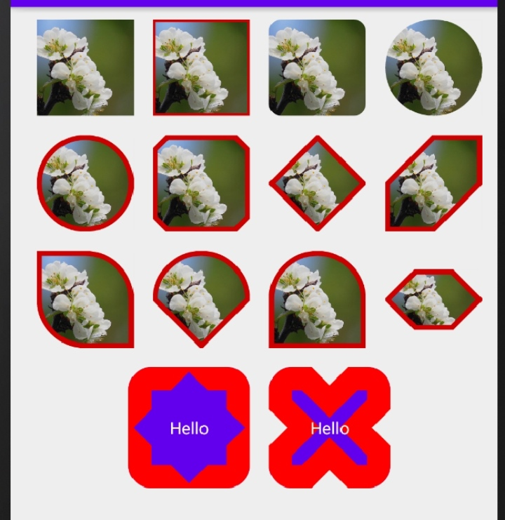

</br>

#### 2. 使用

##### (1) 一般图形

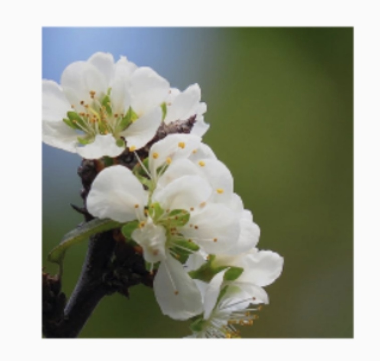

``` xml
<com.google.android.material.imageview.ShapeableImageView
        android:id="@+id/iv1"
        android:layout_width="80dp"
        android:layout_height="80dp"
        android:scaleType="centerCrop"
        android:src="@drawable/bg" />
 
```

##### (2) 加边框

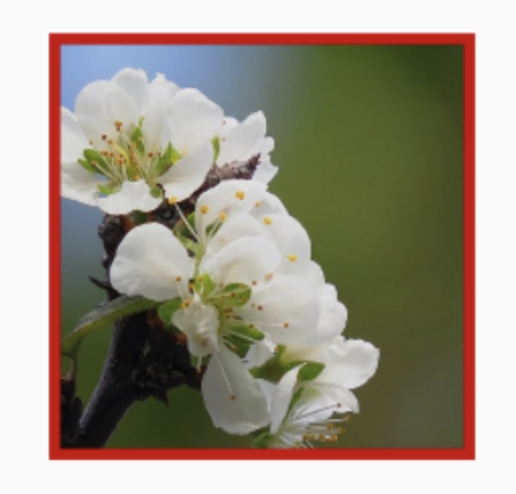

- strokeColor 设置边框颜色
- strokeWidth 设置边框宽度

``` xml
<com.google.android.material.imageview.ShapeableImageView
        android:id="@+id/iv2"
        android:layout_width="80dp"
        android:layout_height="80dp"
        android:scaleType="centerCrop"
        android:src="@drawable/bg"
        app:strokeColor="@android:color/holo_red_dark"
        app:strokeWidth="4dp" />
 
```

##### (3) 设置圆角

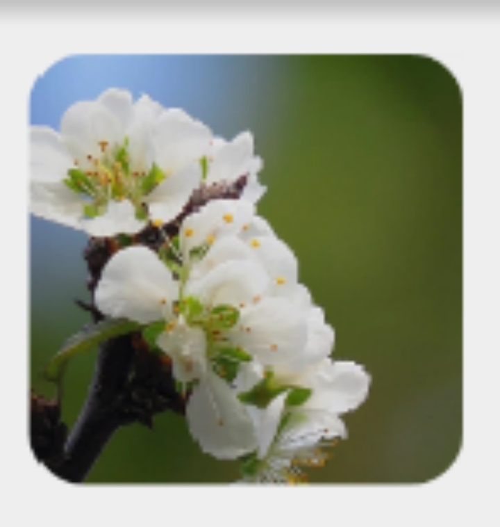

- shapeAppearance 设置形状
- RoundedStyle 
    - cornerFamily 设置圆角类型=rounded
    - cornerSize 设置圆角半径

``` xml
<com.google.android.material.imageview.ShapeableImageView
        android:id="@+id/iv3"
        android:layout_width="80dp"
        android:layout_height="80dp"
        android:scaleType="centerCrop"
        android:src="@drawable/bg"
        app:shapeAppearance="@style/RoundedStyle" />

 <!-- styles.xml -->
 <style name="RoundedStyle">
        <item name="cornerFamily">rounded</item>
        <item name="cornerSize">10dp</item>
 </style>
```

##### (4) 圆形

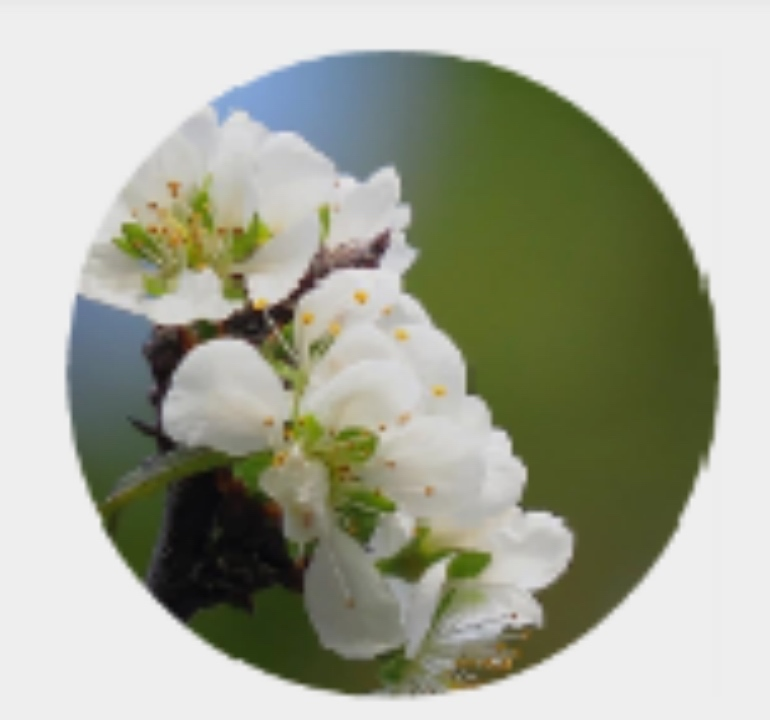

- shapeAppearance 设置形状
- CircleStyle 
    - cornerFamily 设置圆角类型=rounded
    - cornerSize 设置圆角半径，50%为圆形

``` xml
<com.google.android.material.imageview.ShapeableImageView
        android:id="@+id/iv4"
        android:layout_width="80dp"
        android:layout_height="80dp"
        android:scaleType="centerCrop"
        android:src="@drawable/bg"
        app:shapeAppearance="@style/CircleStyle" />

 <!-- styles.xml -->
  <style name="CircleStyle">
        <item name="cornerFamily">rounded</item>
        <item name="cornerSize">50%</item>
 </style>
```

##### (5) 切角

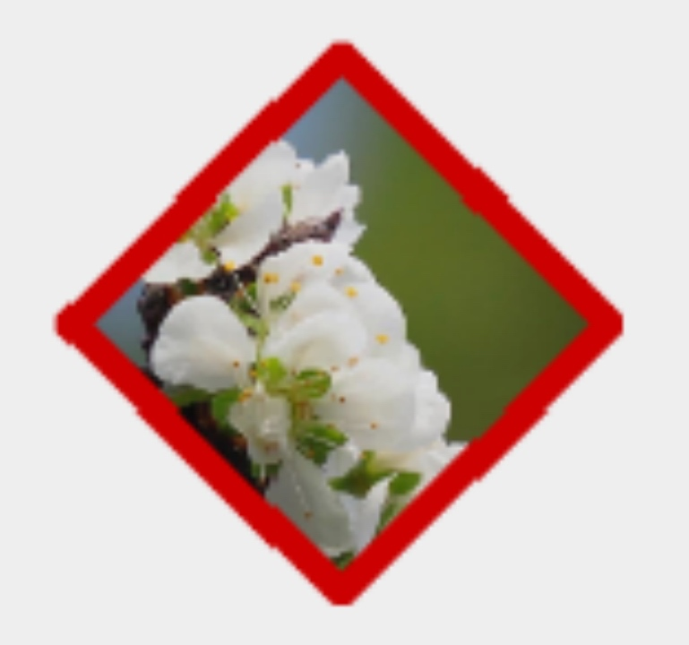

- shapeAppearance 设置形状
- RoundedStyle 
    - cornerFamily 设置圆角类型=cut
    - cornerSize 设置圆角半径

``` xml
<com.google.android.material.imageview.ShapeableImageView
        android:id="@+id/iv7"
        android:layout_width="80dp"
        android:layout_height="80dp"
        android:padding="2dp"
        android:scaleType="centerCrop"
        android:src="@drawable/bg"
        app:shapeAppearance="@style/DiamondStyle"
        app:strokeColor="@android:color/holo_red_dark"
        app:strokeWidth="4dp" />


 <!-- styles.xml -->
 <style name="DiamondStyle">
        <item name="cornerFamily">cut</item>
        <item name="cornerSize">50%</item>
</style>
```

##### (6) 单独设置每个角

- cornerSizeTopLeft/cornerFamilyTopLeft 左上角
- cornerSizeTopRight/cornerFamilyTopRight 右上角
- cornerSizeBottomLeft/cornerFamilyBottomLeft 左下角
- cornerSizeBottomRight/cornerFamilyBottomRight右下角

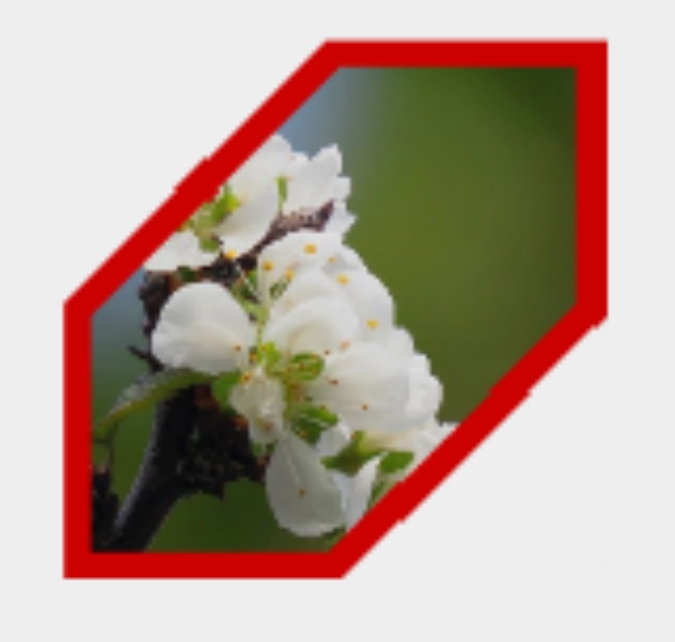
    
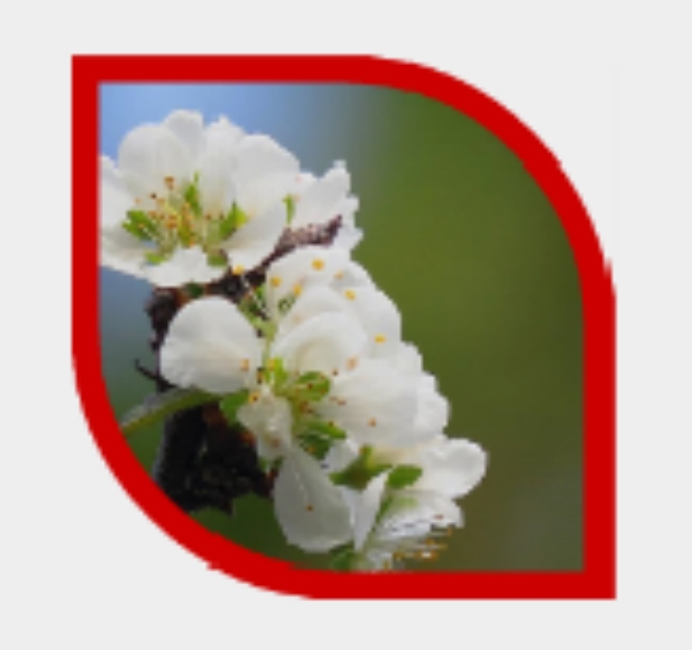
    
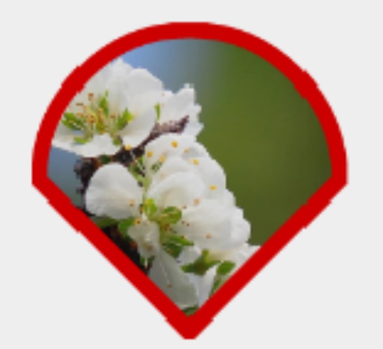

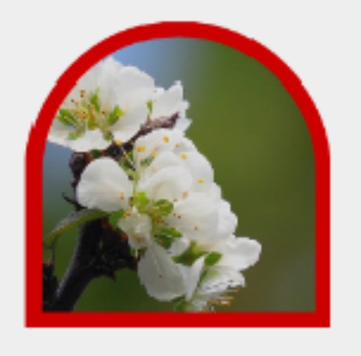

``` xml
<com.google.android.material.imageview.ShapeableImageView
        android:id="@+id/iv8"
        android:layout_width="80dp"
        android:layout_height="80dp"
        android:padding="2dp"
        android:scaleType="centerCrop"
        android:src="@drawable/bg"
        app:shapeAppearance="@style/CutStyle1"
        app:strokeColor="@android:color/holo_red_dark"
        app:strokeWidth="4dp" />
        
<!-- styles.xml -->
<style name="CutStyle1">
        <item name="cornerFamily">cut</item>
        <item name="cornerSizeTopLeft">50%</item>
        <item name="cornerSizeBottomRight">50%</item>
 </style>
```

</br>

#### 3. 属性总结


| 属性 | 作用 |
| :-: | :-: |
| strokeWidth | 设置描边宽度 |
| strokeColor | 设置描边颜色 |
| shapeAppearance | 设置外观(圆角、切角) |
| shapeAppearanceOverlay | 设置外观叠加层，会覆盖shapeAppearance |

</br>

- shapeAppearance

| 属性 | 作用 |
| :-: | :-: |
| cornerFamily |  <div>设置切角(cut)或圆角(rounded)</div> |
| cornerSize |  <div>设置圆角大小：具体dp值；</div><div>百分比（百分比即圆角大小占宽或高的百分比）</div>|
| cornerFamilyTopLeft ... |  <div>设置4个方向的圆角或切角</div>|
| cornerSizeTopLeft ... |  <div>设置4个方向的圆角大小</div>|

</br>

#### 4. 更多自定义形状

##### (1) ShapeAppearanceModel

构建一个形状的边和角，通过使用`MaterialShapeDrawable`来生成、渲染一个View的背景形状

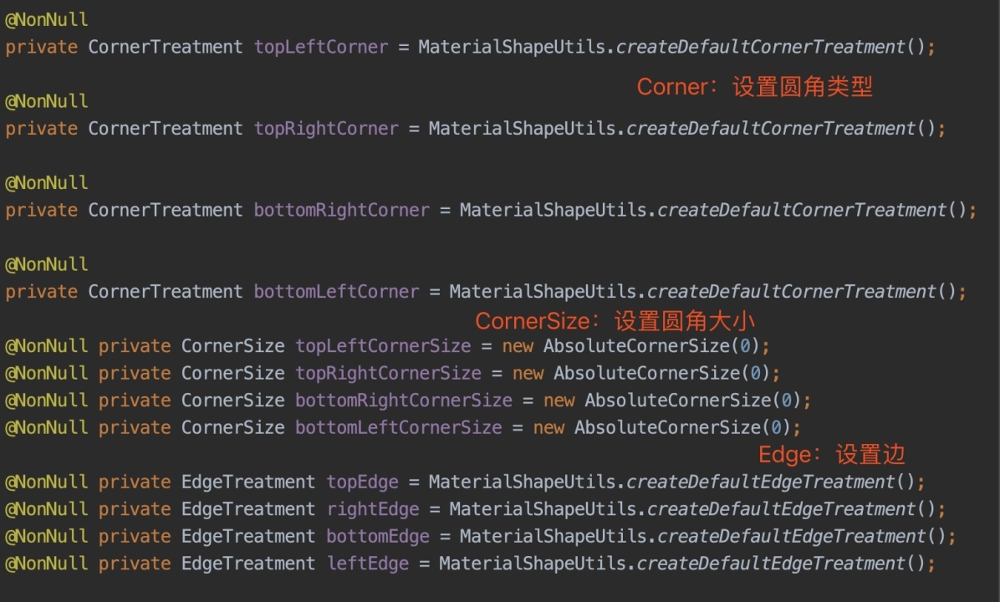

##### (2) 自定义气泡

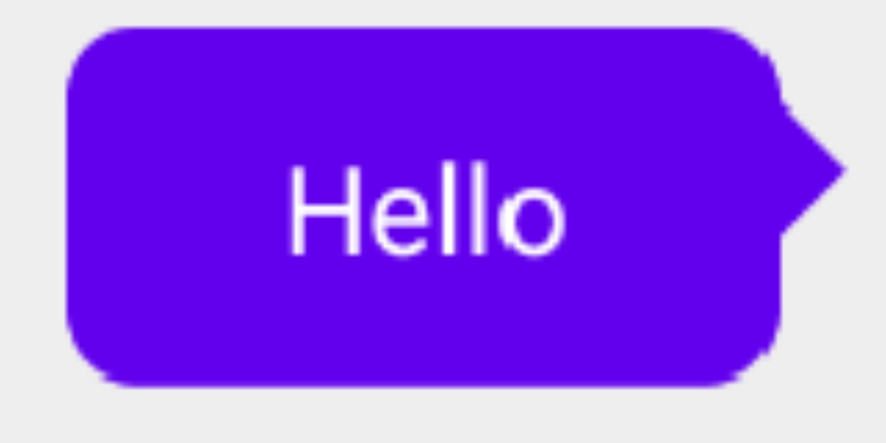

- RoundedCornerTreatment：圆角
- TriangleEdgeTreatment：三角形状
    - getEdgePath：设置三角形位置
- 创建MaterialShapeDrawable对象，传入ShapeAppearanceModel
- 注意设置父View的`clipChildren = false`，否则三角形显示不正常

``` kotlin
val shapeAppearanceModel = ShapeAppearanceModel.builder().apply {
            setAllCorners(RoundedCornerTreatment())
            setAllCornerSizes(20f)
            setRightEdge(object : TriangleEdgeTreatment(20f, false) {
                override fun getEdgePath(
                    length: Float,
                    center: Float,
                    interpolation: Float,
                    shapePath: ShapePath
                ) {
                    super.getEdgePath(length, length / 3f, interpolation, shapePath)
                }
            })
        }.build()
        val drawable = MaterialShapeDrawable(shapeAppearanceModel).apply {
            setTint(ContextCompat.getColor(this@MainActivity, R.color.colorPrimary))

        }
        (tv1.parent as ViewGroup).clipChildren = false
        tv1.background = drawable
```


