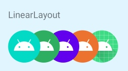
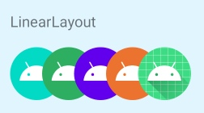

# 改变子View的绘制顺序

### 需求场景

要求前一个控件盖住后一个的一部分



而普通的LinearLayout，设置负margin，是后一个控件盖住前一个控件的，因为绘制顺序为：从左到右。




</br>

思考：

- RecyclerView可以设置reverseLayout控制子View反向绘制

- LinearLayout子View的绘制顺序怎么改变呢？


</br>

### 使用RTL布局

- 国内环境一般是LTR布局，从左到右的布局方式

- RTL，即 Right-to-Left，从右到左的布局方式，经常用在阿拉伯语之类的环境中

- 在LinearLayout里
    
    - LTR布局：第一个View是在左上，先绘制左上的View
    
    - RTL布局：第一个View是在右上，先绘制右上的View

    
</br>

##### 怎么使用RTL布局

- AndroidManifest.xml，将<application>标签的android:supportsRtl设为true

- 对应ViewGroup的android:layoutDirection设为rtl

- marginEnd 相当于marginLeft

- marginStart相当于marginRight

</br>

如，用RTL布局实现上述场景：


``` 
android:layoutDirection=“rtl”
android:gravity="end"
```

</br>

### 修改子View绘制顺序

##### 1. ViewGroup是如何确定子View的绘制顺序的

ViewGroup在dispatchDraw()方法中绘制子视图。

``` java
    @Override
    protected void dispatchDraw(Canvas canvas) {
        final int childrenCount = mChildrenCount;
        final View[] children = mChildren;  // 子View
        int flags = mGroupFlags;

        // 省略...
        
        // 构建指定排序的子View列表preorderedList
        final ArrayList<View> preorderedList = isHardwareAccelerated()
                ? null : buildOrderedChildList();
        // 是否有指定绘制顺序
        final boolean customOrder = preorderedList == null
                && isChildrenDrawingOrderEnabled();
        for (int i = 0; i < childrenCount; i++) {
           
            // 省略...
           
           // 按顺序找到子View
            final int childIndex = getAndVerifyPreorderedIndex(childrenCount, i, customOrder);
            final View child = getAndVerifyPreorderedView(preorderedList, children, childIndex);
            if ((child.mViewFlags & VISIBILITY_MASK) == VISIBLE || child.getAnimation() != null) {
                // 绘制子View
                more |= drawChild(canvas, child, drawingTime);
            }
        }
        
        // 省略...
    }
```

说明：

- ViewGroup通过mChildren数组来存储子View

- 一般绘制顺序是[0 ~ childCount)

- 绘制的child不是mChildren[i]，而是通过getAndVerifyPreorderedView()获取

- childIndex是要绘制的子View的索引

</br>

##### 2. 是否允许自定义子View绘制顺序
isChildrenDrawingOrderEnabled()

``` java
    @ViewDebug.ExportedProperty(category = "drawing")
    protected boolean isChildrenDrawingOrderEnabled() {
        return (mGroupFlags & FLAG_USE_CHILD_DRAWING_ORDER) == FLAG_USE_CHILD_DRAWING_ORDER;
    }
```

说明:

- 默认的mGroupFlags是没有FLAG_USE_CHILD_DRAWING_ORDER的，即默认不允许自定义绘制顺序

- 通过调用`ViewGroup.setChildrenDrawingOrderEnabled(true)`，设置允许自定义子View绘制顺序

</br>

##### 3. 确定要绘制的子View

getAndVerifyPreorderedView()

``` java 
    private int getAndVerifyPreorderedIndex(int childrenCount, int i, boolean customOrder) {
        final int childIndex;
        if (customOrder) {
            final int childIndex1 = getChildDrawingOrder(childrenCount, i);
            if (childIndex1 >= childrenCount) {
                throw new IndexOutOfBoundsException("getChildDrawingOrder() "
                        + "returned invalid index " + childIndex1
                        + " (child count is " + childrenCount + ")");
            }
            childIndex = childIndex1;
        } else {
            childIndex = i;
        }
        return childIndex;
    }
```

说明：

- preorderedList: 指定排序的子View列表

- preorderedList 不为空，则从preorderedList里获取子View

- preorderedList 为空，则从children里获取子View

``` java
preorderedList = usingRenderNodeProperties ? null : buildOrderedChildList();
```

</br>

##### 4. 构建排序的子View列表

buildOrderedChildList()

``` java
    ArrayList<View> buildOrderedChildList() {
        // 省略...

        final boolean customOrder = isChildrenDrawingOrderEnabled();
        for (int i = 0; i < childrenCount; i++) {
            // add next child (in child order) to end of list
            final int childIndex = getAndVerifyPreorderedIndex(childrenCount, i, customOrder);
            final View nextChild = mChildren[childIndex];
            final float currentZ = nextChild.getZ();

            // insert ahead of any Views with greater Z
            int insertIndex = i;
            while (insertIndex > 0 && mPreSortedChildren.get(insertIndex - 1).getZ() > currentZ) {
                insertIndex--;
            }
            mPreSortedChildren.add(insertIndex, nextChild);
        }
        return mPreSortedChildren;
    }
```

说明：
- z轴的值越大，绘制的顺序越前，而一般来讲ViewGroup中子View的getZ都是相同的

- 主要影响childIndex的是`getAndVerifyPreorderedIndex(childrenCount, i, customOrder)`

</br>

##### 5. 确定子View顺序

getAndVerifyPreorderedIndex()

``` java
    private int getAndVerifyPreorderedIndex(int childrenCount, int i, boolean customOrder) {
        final int childIndex;
        if (customOrder) {
            final int childIndex1 = getChildDrawingOrder(childrenCount, i);
            if (childIndex1 >= childrenCount) {
                throw new IndexOutOfBoundsException("getChildDrawingOrder() "
                        + "returned invalid index " + childIndex1
                        + " (child count is " + childrenCount + ")");
            }
            childIndex = childIndex1;
        } else {
            childIndex = i;
        }
        return childIndex;
    }
```

可以看到，子View索引Index，是在getChildDrawingOrder()中获取的。

``` java
    protected int getChildDrawingOrder(int childCount, int drawingPosition) {
        return drawingPosition;
    }
```

因此，只需要修改`getChildDrawingOrder()`，就可以修改子View的绘制顺序。

</br>

### 实现文章一开头的需求

从最后一个子View开始绘制

``` kotlin
class ReverseLinearLayout @JvmOverloads constructor(
    context: Context, attrs: AttributeSet? = null, defStyleAttr: Int = 0
) : LinearLayout(context, attrs, defStyleAttr) {

    init {
        // 允许自定义子View绘制顺序
        isChildrenDrawingOrderEnabled = true
    }

    override fun getChildDrawingOrder(childCount: Int, drawingPosition: Int): Int {
        // 反转绘制顺序
        if (childCount - 1 >= drawingPosition) {
            return childCount - 1 - drawingPosition
        }
        return drawingPosition
    }

}
```