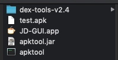
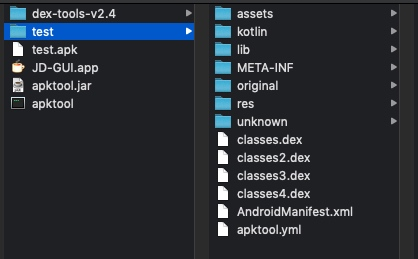
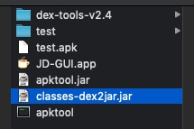
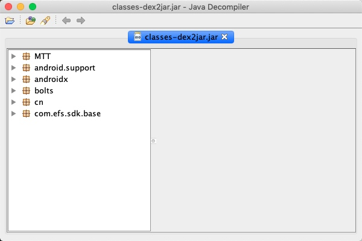
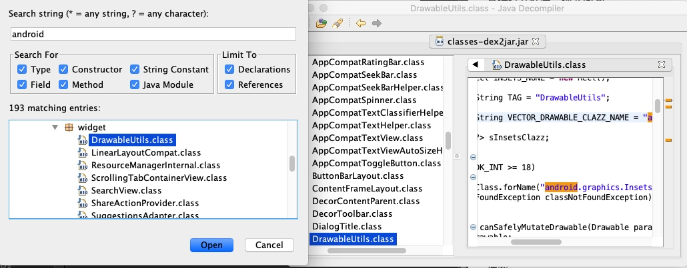

# 反编译apk

### 缘由

某app被市场打回来，

`下载apk，反编译后全局搜索secret，能获取到明文secret，访问链接，获得token，能成功调用`

改完之后，反编译试试看

### 1. 需要的工具

- APKTool：反编译apk的工具 [下载地址](https://apktool.org/docs/install)

- dex2jar：将class.dex文件转成jar文件 [下载地址](https://github.com/pxb1988/dex2jar)

- jd-GUI：查看jar包代码 [下载地址](https://java-decompiler.github.io/)

放到一个目录下，解压


### 2. 反编译

#### ① 解压apk

给apktool加权限
```
chmod +x apktool
chmod +x apktool.jar
```

解压
```
./apktool d -s test.apk
```

如图



#### ② dex文件解压成jar文件

给dex2jar加权限

```
chmod +x dex-tools-v2.4/d2j-dex2jar.sh
```

解压

```
./dex-tools-v2.4/d2j-dex2jar.sh test/classes.dex
```

得到 classes-dex2jar.jar



#### ③ 利用jd-GUI查看jar包代码

直接打开程序，拖入jar包


搜索


