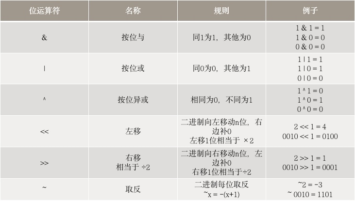

# 位运算

#### 1. 位运算符



</br>

#### 2. 应用

##### （1）判断奇偶性

|  | 奇数 | 偶数 |
| :-: | :-: | :-: |
| 普通方法 | n % 2 == 1 | n % 2 == 0 |
| 特点 | 二进制最后一位是1 | 二进制最后一位是0 |
| 按位与：同1为1，其他为0 | n & 1 == 1 | n & 1 == 0 |
| 例子 | 3 (0011) & 1 == 1 | 4 (0100) & 1 == 0 |


##### （2）交换两个数

- 一般方法：
```
temp = b
b = a
a = temp
```

- 位运算：
```
a = a ^ b
b = a ^ b
a = a ^ b
```

- 原理：
`相同的数异或的结果是0`
```
a = a ^ b
b = (a ^ b) ^ b = a ^ b ^ b = a ^ 0 = a
a = a ^ b ^ a = b ^ 0 = b 
```

##### （3） 数组中有一个数只出现了一次，其他的数都出现了两次，找出出现一次的数

- 一般方法：HashMap记录个数

- 位运算：遍历数组，对每个元素做异或运算

- 原理：`相同的数异或的结果是0`
```
找出 {1, 1, 2, 3, 2} 出现一次的数
1 ^ 1 ^ 2 ^ 3 ^ 2 = 0 ^ 3 = 3
```

##### （4）给定一个数组，将数组的元素打乱并插入一个新的元素，找出这个新的元素

- 一般方法：HashMap记录每个元素出现的次数

- 位运算：按位异或运算

- 原理：`相同的数异或的结果是0`
```
s1 = 1, 2, 3
s2 = 2, 1, 5, 3
1 ^ 2 ^ 3 ^ 2 ^ 1 ^ 5 ^ 3 = 0 ^ 5 = 5
```

##### （5）判断一个数n是否为2的幂
- 一般方法：循环让n一直除以2

- 位运算：
```
n > 0 && n & (n - 1) == 0
```

- 原理：`按位与 - 同1为1，其他为0`
```
如果n是2的幂，则：
1. n的二进制最高位是1，其余位是0，如 8(1000)，16(10000)
2. n – 1的二进制最高位是0，其余位是1，如 7(0111)，15(01111)
```

##### （6）找出不大于n的最大的2的幂
- 一般方法：循环从1开始乘2

- 位运算：
```
1.  n | = n >> 1
        n | = n >> 2
        n | = n >> 4
        n | = n >> 16
2.  n += 1
3.  n >> 1
```

- 原理：
```
假设n = 2^7 +1，二进制是10000001，结果是2^7（10000000）。
1. 找出二进制最左边的1（假设第k位），把k右边位全变成0
2. 得到的数+1，则k -1 位为1，k后面为0
3. 右移一位
.
如计算2^2：
>>1   1000 0001 | 0100 0000 = 1100 0001  →  第k+1位变成了1
>>2   1100 0001 | 0011 0000 = 1111 0001  →  k+1..k+3
>>4   1111 0001 | 0000 1111 = 1111 1111  →  k后全变成了1
```

###### （7）计算一个数n的二进制里有多少个1
- 一般方法：循环右移

- 位运算：n &= (n-1)

- 原理:
```
假设n = 11000001，结果是3
1. n – 1  → 将n二进制右数第一个1及后面位取反
2.  n & (n-1)   → 将右数第一个1变成0
3.  n = 0退出循环
.
如：
1100 0001 & 1100 0000 = 1100 0000   count = 1
1100 0000 & 1011 1111 = 1000 0000   count = 2
1000 0000 & 0111 1111 = 0000 0000   count = 3 
```

#####（8） 计算一个数n的二进制里1的奇偶数
- 一般方法：循环右移

- 位运算：
```
1.  n ^ = n >> 1
        n ^ = n >> 2
        n ^ = n >> 4
        n ^ = n >> 16
2. n 是偶数，则有偶数个1;反之，有奇数个1
```

- 原理：
```
假设n =10000001，结果是偶数。
>>1   1000 0001 ^ 0100 0000 = 1100 0001  
>>2   1100 0001 ^ 0011 0000 = 1111 
>>4   1111 0001 ^ 0000 1111 = 1111 1110  →  偶数
```

#####（9）m的n次方
- 一般方法：循环乘

- 位运算：将n的二进制拆分

- 原理:
```
假设 n = 6，6 二进制 = 0110
则 m6 = m0110 =  m0100 * m0010
.
通过右移逐位读取 0110，temp = m
1. 若n是奇数（末位1），则result *= temp
2. temp *= temp
3. n >> 1，继续(1)
.
.
第一次：n = 0110
1. n是偶数，result = m0
2. temp = m * m
3. n = 0011
.
第二次：n = 0011
1. n是奇数，result = m2
2. temp = m4
3. n = 0001
.
第三次：n = 0001
1. n是奇数，result = m6
2. temp = m8
3. n = 0000，退出循环
```