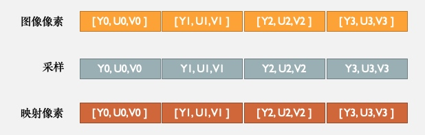

# YUV 采样与存储

### Camera2怎么获取预览帧数据

- Camera 可以直接在预览的回调接口 onPreviewFrame(data, camera) 中获取NV21格式的预览数据。

- Camera2的预览回调：void onImageAvailable(ImageReader reader)，通过 reader.acquireLatestImage() 获取Image对象。

- Image 是 Camera2 获取的预览帧原始数据的载体，用于统一管理中间图片数据

- Camera2 默认采样格式（推荐采样格式）是 YUV_420_888

- 从Image封装的数据中，就可以取得 YUV的 byte[] 数据

</br>

### YUV是一种颜色编码方法

##### 比较熟悉的RGB

- R — 红，G — 绿，B — 蓝

- 每个像素对应R、G、B，每个分量占 8bit，一个像素占 24bit，3个字节


##### YUV

- Y — 明亮度（灰阶），U、V — 色度（色调、饱和度）

- 每个像素对应Y、U、V，每个分量占 8bit

- Y和UV可以分离，如果只有Y，就是黑白图像

- 所以根据不同的采样格式，可以节省存储空间

</br>

### 常见YUV采样格式

##### YUV_444_888

- 4:4:4，每个分量的采样比例相同

- 采样时每个像素的三个分量信息完整

如图：



计算 480 × 360 图片占用存储空间大小:

```
480 × 360 × 3 / 1024 / 1024 = 0.494 MB
```

</br>

##### YUV_422_888

- 4:2:2，Y 和 UV 的比例是 2:1:1

- U、V 分量，间隔像素采样，两个相邻的像素，共用一个UV分量

如图：


计算 480 × 360 图片占用存储空间大小：

```
(480 × 360 × 1) + (480 × 360 ×0.5) × 2  = 345600 byte 
345600 / 1024 / 1024 = 0.329 MB
```

与 YUV_444 相比，节省了 33.4% 的存储空间

</br>

##### YUV_420_888

- 4:2:0， Y 和 UV 的比例是 4:1:1

- 第一行只要U，第二行只要V …

- 4个像素点共用1个UV

如图：


计算 480 × 360 图片占用存储空间大小

```
(480 × 360 × 1) + (480 × 360 ×0.25) × 2  = 259200 byte
259200 / 1024 / 1024 = 0.247 MB
```

与 YUV_444 相比，节省了 50% 的存储空间

</br>

### YUV存储格式

- 平面格式（planar format）
    
    先连续存储所有像素点的Y分量，再连续存储所有像素点的U分量，最后连续存储所有像素点的V分量
    
- 打包格式（packed format）

    每个像素点的Y、U、V连续交错存储
    
- 不同的采样格式 × 不同的存储格式，产生了很多种不同的YUV存储方式

</br>

##### YUV420p

- 采样格式 YUV_420 × 平面存储格式

- 先存储所有Y，再存储所有U或者V

如图：


###### 常用YUV420p格式

- YU12 又称 I420：
    
    先存储Y分量，再存储U分量，最后存储V分量。
    
    

    
- YV12

    先存储Y分量，再存储V分量，最后存储U分量。
    
    

</br>

##### YUV420sp

- 采样格式 YUV_420 × 半平面存储格式

- 先存储所有Y，按UV或VU交替顺序存储

如图：


###### 常用YUV420sp格式

- NV12 `IOS的模式`
    
    先存储Y分量，再按UV交替存储。

    


- NV21 `Android的模式`

    先存储Y分量，按VU交替存储。
    
    


</br>

### YUV_420_888格式下Image的数据规则

- Y、U、V分量存储在image.planes中。

    - image.planes[0] 为 Y 分量数据
    
    - image.planes[1] 为 U 分量数据
    
    - image.planes[2] 为 V 分量数据

- y-planes，Y分量数据一定是连续存储的，pixelStride一定为1。

- u-planes 与 v-planes，pixelStride不固定，不同的存储格式中，u-planes与v-planes得到的分量值不一样。
    - 平面格式：

        u-planes.pixelStride = v-planes.pixelStride = 1，可以从 u-planes 与 v-planes 中获取所有UV分量。

    - 半平面格式：UV交叉存储
        
        u-planes.pixelStride = v-planes.pixelStride = 2，表示 u-planes中，索引 0 2 4 … 才有U分量数据，v-planes同理。

- 每一个plane有一个rowStride，表示一行数据的长度，rowStride ≥ width，当 rowStride > width，图片存在绿边。

- u-planes.rowStride = v-planes.rowStride

</br>

如图：


- format = YUV_420_888

- width = rowStride

- y.pixelStride = 1

- ySize = width × height

- u.pixelStride = v.pixelStride = 2

- uSize = vSize = ySize / 2

- 所以，对于YUV_420_888，半平面存储格式：
    - NV12 = plane[0] + plane[1]
    
    - NV21 = plane[0] + plane[2]